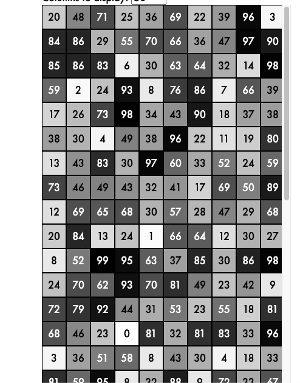
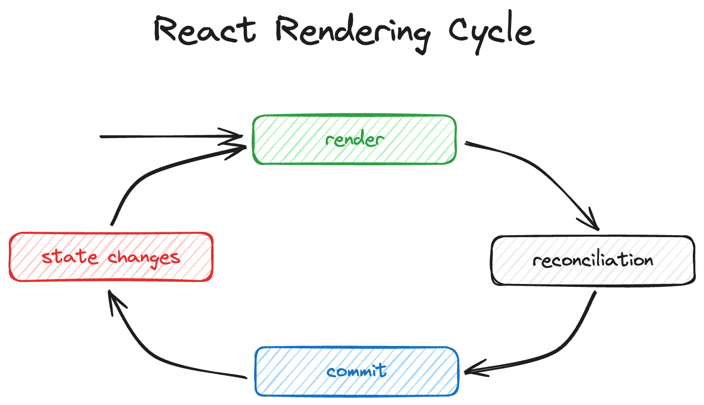

# Epic React


# Forms

React tiene un atajo para el manejo de formularios, y es utilizando action en un form. Esta prop action le podemos pasar una función en la que react ya lo convirtió a form data, hizo el preventDefault y luego hace un reset del form por nosotros.

Cuando se pasa una URL a la acción, el formulario se comportará como el componente del formulario HTML. Cuando una función se pasa a la acción, la función se encargará del envío del formulario. La función pasada a la acción puede ser asíncrona y se llamará con un único argumento que contiene los datos del formulario enviado. La propiedad de acción puede ser anulada por un atributo formAction en un componente <button>, <input type=«submit»> o <input type=«image»>.

```javascript
export default function Search() {
  function search(formData) {
    const query = formData.get("query");
    alert(`You searched for '${query}'`);
  }
  return (
    <form action={search}>
      <input name="query" />
      <button type="submit">Search</button>
    </form>
  );
}
```

### Inputs

Tener en cuenta que en checkboxes, el valor al hacer un submit es "on" si está check, pero en caso de no estarlo la key del checkbox no se envía, no es que se envía 'off'

En inputs hidden si queremos pasar estructuras de datos más complejas podemos utilizar JSON.stringify


```javascript
<input
	type="hidden"
	name="order"
	value={JSON.stringify({ sandwich: 'tuna' })}
/>
```
### Default values

Es posible que hayas notado que en el paso anterior utilizamos una propuesta de valor. Así es como se establece el valor en un documento HTML. Sin embargo, React es un poco especial y admite lo que se llama "entradas controladas", lo que significa que puede controlar mediante programación el valor de la entrada.
Por esta razón, cuando estableces la propiedad de valor en una entrada como esta, significa que React esperará que mantengas ese valor actualizado y no permitirá que el usuario cambie el valor a nada que no sea lo que has especificado en la propuesta de valor. Efectivamente, esto significa que si establecemos el valor en uno de nuestros campos, el usuario no puede cambiarlo a menos que hagamos un poco de trabajo adicional. Esta es una característica muy útil que discutiremos más adelante, pero ahora tiene implicaciones para nuestro formulario, así que abordemos esto.
La cuestión es que queremos que varios de estos campos tengan un valor predeterminado, pero queremos que el usuario pueda cambiarlos. Con la excepción de la entrada oculta, no podemos hacer eso con la propuesta de valor. Entonces necesitamos usar un accesorio diferente.
En React, usa la propiedad defaultValue para establecer el valor predeterminado de una entrada y la propiedad defaultChecked para establecer el valor predeterminado de una casilla de verificación o radio. El valor predeterminado debe ser una cadena (o se convertirá en una cadena) que coincida con el formato de la entrada.


### Async errors

En React, debes considerar dos tipos de errores: errores que ocurren durante el renderizado y errores que no ocurren (como un event handler, una devolución de llamada useEffect o una promesa .then/.catch).
React usa try/catch para detectar errores que ocurren durante el renderizado, pero React no puede detectar todos estos tipos de errores porque ocurren fuera de la pila de llamadas de React.
Por lo tanto, debes manejarlos tú mismo. No es muy frecuente que necesite manejar este tipo de errores en aplicaciones del mundo real utilizando patrones y marcos de React modernos, pero puede encontrarse con casos en los que sea útil. La forma más sencilla de hacer esto es utilizar el hook useErrorBoundary de la libreria react-error-boundary

```javascript
function App() {
	const { showBoundary } = useErrorBoundary()

	useEffect(() => {
		function handleMouseMove(event) {
			try {
				// Do something that could throw
			} catch (error) {
				showBoundary(error)
			}
		}
		window.addEventListener('mousemove', handleMouseMove)
		return () => {
			window.removeEventListener('mousemove', handleMouseMove)
		}
	})

	// Render ...
}

```

# React Hooks

useState nos permite pasar una función en lugar de un valor, eso hace que esa función se ejecute solo la primera vez que se carga el componente, evitando problemas de performance, ejemplo con localStorage.

```javascript
 const [name, setName] = React.useState(window.localStorage.getItem('name') || initialName)
```
Supongamos que queremos que se cargue como initial state algo que este en el localStorage, de la manera que esta arriba, lo que sucederá es que el localStorage se consultara en cada re renderizado del componente, lo que no tiene sentido.

En cambio, si pasamos una función se ejecutará solo en el primer render.

```javascript
 const [name, setName] = React.useState( () => window.localStorage.getItem('name') || initialName)
```

Esta funcionalidad es llamada lazy initialization.

<br/>

### Dependencias en useEffect

Las dependencias en el useEffect se comparan como un === por lo tanto si pongo objetos, arrays o funciones, para React es como si siempre cambiaran, hay que poner valores que puedan compararse

<br/>

### Hooks flow


<br>


### Lifting state

Cuando un estado debe ser compartido por dos componentes que son hermanos, es decir que estan al mismo nivel, lo mejor es pasar ese estado al padre, a ese concepto se lo llama lefting state, que significaria llevarlo para arriba.


### Colocate state

Se refiere a lo contrario, dejar el estado lo mas cerca posible de donde sera utilizado, lo mismo con el context, a veces no es necesario que el contxt envuelva toda la app.

### Components composition

Antes de utilizar context, intentar hacer composition de componentes, que es muy eficaz para evitar pasar props innecesariamente, aprovechar que React permite pasar el children como prop para componet, por ejemplo:
 Imaginemos que nuestro componente dashbord tiene un dentro un dashboardContent que dentro tiene un dashboardHeader que usa el name del user para mostrar el menu. En lugar de pasar el user por 3 componentes hasta el lugar donde se usa, la composición ayudaria

```jsx
<Dashboard>
  <DashboardContent>
    <DashboardHeader user={currentUser}>
  </DashboardContent>
<Dashboard>

```

### Derive state

Muchas veces sucede que el primer instinto es tener un state para casa cosa que se nos ocurre que puede cambiar, el problema de eso es que a medida que las cosas crecen y se sigue agregando state es dificil de poder sincronizarlo y mantenerlo, por eso, siempre que se puede es mejor tener state derivado, que significa esto? que nuestro state se forme a partir de otro, por ejemplo:

```javascript
function Board() {
  const [squares, setSquares] = React.useState(Array(9).fill(null))
  const [nextValue, setNextValue] = React.useState(calculateNextValue(squares))
  const [winner, setWinner] = React.useState(calculateWinner(squares))
  const [status, setStatus] = React.useState(calculateStatus(squares))
  function selectSquare(square) {
    if (winner || squares[square]) {
      return
    }
    const squaresCopy = [...squares]
    squaresCopy[square] = nextValue
    const newNextValue = calculateNextValue(squaresCopy)
    const newWinner = calculateWinner(squaresCopy)
    const newStatus = calculateStatus(newWinner, squaresCopy, newNextValue)
    setSquares(squaresCopy)
    setNextValue(newNextValue)
    setWinner(newWinner)
    setStatus(newStatus)
  }
  // return beautiful JSX
}
```

En este caso tenemos bastante state que mantener, y al ejecutar una funcion estamos realizando 4 setStates distintos, una solucionmuy simple a este problema seria:

```javascript
function Board() {
  const [squares, setSquares] = React.useState(Array(9).fill(null))
  const nextValue = calculateNextValue(squares)
  const winner = calculateWinner(squares)
  const status = calculateStatus(winner, squares, nextValue)
  function selectSquare(square) {
    if (winner || squares[square]) {
      return
    }
    const squaresCopy = [...squares]
    squaresCopy[square] = nextValue
    setSquares(squaresCopy)
  }
  // return beautiful JSX
}
```

tener un unico state y los otros valores si vemos se estan calculando a partir de ese state, o sea que cada vez que ese state cambie, el componente se renderizara y los valores se volveran a calcular, sin preocuparnos por setear nosotros un monton de state y quitando complejidad.


### Optimización del estado

Si establece el estado en el valor exacto en el que ya está configurado, React no hace un nuevo render de sus componentes porque sabe que nada ha cambiado.

```javascript
const [count, setCount] = useState(0)

// ...
setCount(0) // <-- will not trigger a rerender if the state is still 0
```

Con objetos es un poco más tricky porque debes estar seguro de returnar exactamente el mismo objeto

```javascript
const [state, setState] = useState({ count: 0 })

// ...
setState({ count: 0 }) // <-- will trigger a rerender
setState((previousState) => ({
	count: previousState.count,
})) // <-- will trigger a rerender
setState((previousState) => previousState) // <-- will not trigger a rerender

```
Entonces, con un poco de previsión, puede optimizar sus actualizaciones de estado determinando usted mismo si el estado ha cambiado y devolviendo el estado original si no es así. Esto se aplica tanto en un reductor para useReducer como en la devolución de llamada para useState.

Esto es útil porque en algunos casos podemos comprobar nuestro estado con el anterior y decidir si queremos cambiarlo o solo retornar el anterior para evitar un re render innecesario.

Ejemplo con search params

```javascript
  setSearchParams( prevParams => {
    const newParams = new URLSearchParams(window.location.search)
    if(prevParams.toString === newParams.toString()){
      return prevParams
    }
    return newParams
  })
```


### Flush sync

Ayudar a que el usuario se concentre en el lugar correcto es una parte clave de la experiencia del usuario. Esto es especialmente importante para los usuarios que dependen de lectores de pantalla o navegación con teclado.
A veces, el elemento en el que desea centrarse sólo está disponible después de una actualización de estado. Por ejemplo:

```javascript
function MyComponent() {
	const [show, setShow] = useState(false)

	return (
		<div>
			<button onClick={() => setShow(true)}>Show</button>
			{show ? <input /> : null}
		</div>
	)
}

```

Presumiblemente, después de que el usuario haga clic en "mostrar", querrá escribir algo en la entrada allí. Una buena gestión del enfoque enfocaría la entrada después de que se vuelva visible.
Es importante que sepas que en el estado React las actualizaciones ocurren en lotes. Por lo tanto, las actualizaciones de estado no necesariamente se realizan al mismo tiempo que se llama a la función de actualización de estado.
Como resultado del procesamiento por lotes de actualizaciones de estado de React, si intenta enfocar un elemento inmediatamente después de una actualización de estado, es posible que no funcione como se esperaba. Esto se debe a que es posible que el elemento en el que desea centrarse aún no esté disponible.

```javascript
function MyComponent() {
	const inputRef = useRef<HTMLInputElement>(null)
	const [show, setShow] = useState(false)

	return (
		<div>
			<button
				onClick={() => {
					setShow(true)
					inputRef.current?.focus() // This probably won't work
				}}
			>
				Show
			</button>
			{show ? <input ref={inputRef} /> : null}
		</div>
	)
}


```

La solución a este problema es forzar a React a ejecutar el estado y las actualizaciones de DOM sincrónicamente para que el elemento en el que desea enfocarse esté disponible cuando intente enfocarlo.
Para ello, utilice la función flushSync del paquete react-dom.


```javascript
import { flushSync } from 'react-dom'

function MyComponent() {
	const inputRef = useRef<HTMLInputElement>(null)
	const [show, setShow] = useState(false)

	return (
		<div>
			<button
				onClick={() => {
					flushSync(() => {
						setShow(true)
					})
					inputRef.current?.focus()
				}}
			>
				Show
			</button>
			{show ? <input ref={inputRef} /> : null}
		</div>
	)
}
```

Lo que hace flushSync es obligar a React a ejecutar la actualización de estado y la actualización de DOM de forma sincrónica. De esta manera, el elemento de entrada estará disponible cuando intente enfocarlo en la línea que sigue a la llamada de FlushSync.
En general, desea evitar esta desoptimización, pero en algunos casos (como la gestión del enfoque), es la solución perfecta.


### useSyncExternalStore

No todo lo que construimos en la web se crea con React. Hay bibliotecas y API de plataforma que son externas a React. Incorporar esas cosas al modelo de componentes de React y al ciclo de vida de gestión de estado es necesario para crear aplicaciones con todas las funciones.
La tarea es sincronizar el mundo externo con el estado interno de un componente de React. Para hacer esto, usamos el hook useSyncExternalStore.
Tomemos el ejemplo de un componente que muestra su ubicación actual a través de la API de geolocalización. La API de geolocalización no forma parte de React, por lo que necesitamos sincronizar el estado externo de la API de geolocalización con el estado interno de nuestro componente.

```javascript
import { useSyncExternalStore } from 'react'

type LocationData =
	| { status: 'unavailable'; geo?: never }
	| { status: 'available'; geo: GeolocationPosition }
// this variable is our external store!
let location: LocationData = { status: 'unavailable' }

function subscribeToGeolocation(callback: () => void) {
	const watchId = navigator.geolocation.watchPosition((position) => {
		location = { status: 'available', geo: position }
		callback()
	})
	return () => {
		location = { status: 'unavailable' }
		return navigator.geolocation.clearWatch(watchId)
	}
}

function getGeolocationSnapshot() {
	return location
}

function MyLocation() {
	const location = useSyncExternalStore(
		subscribeToGeolocation,
		getGeolocationSnapshot,
	)
	return (
		<div>
			{location.status === 'unavailable' ? (
				'Your location is unavailable'
			) : (
				<>
					Your location is {location.geo.coords.latitude.toFixed(2)}
					{'°, '}
					{location.geo.coords.longitude.toFixed(2)}
					{'°'}
				</>
			)}
		</div>
	)
}

```

Esta es la API básica

```javascript
const snapshot = useSyncExternalStore(
	subscribe,
	getSnapshot,
	getServerSnapshot, // optional
)

```

subscribe es una función que recibe un callback y devuelve una función de limpieza. El callback se llama cada vez que cambia el store externo para que React sepa que debe llamar a getSnapshot para obtener el nuevo valor.
getSnapshot es una función que devuelve el valor actual del store externo.
getServerSnapshot es una función opcional que devuelve el valor actual del store externo del servidor. Esto es útil para el renderizado y la rehidratación del lado del servidor. Si no proporciona esta función, React representará el límite de Suspense alternativo más cercano en el servidor y luego, cuando el cliente se hidrate, llamará a getSnapshot para obtener el valor actual.

### useRef

A veces necesitamos interactuar directamente con el dom, useRef nos da esa posibilidad, tambien useRef nos dara una referencia que a diferencia del state se mantiene siempre igual a traves de los renders, salvo que nosotros cambiemos el valor.

Algo importante a considerar, para hacer uso del ref el componente debe estar montado, es por eso que en muchas veces se hace así:

```javascript
import { useEffect, useRef } from "react";
import { animationFrames, animationTiming } from "../utils";

const AnimatedUseEffect = () => {
  const ref = useRef(null);

  useEffect(() => {
    console.log("animation with useEffect!");
    ref.current?.animate(animationFrames, animationTiming);
  }, []);

  return (
    <h1 ref={ref}>Hello, world</h1>
  );
};

export default AnimatedUseEffect;
```

Pero, una alternativa que podemos utilizar, es hacer uso del callback que nos da ref.

```javascript
<h1
  ref={(node) => {
    ref.current = node;
  }}
/>

```

La función RefCallback se ejecutará después de que el componente se monte, se vuelva a renderizar o se desmonte.
Ahora, con este conocimiento, ¿cómo puedes refactorizar el código anterior y dejar de usar la combinación useEffect y useRef?


```javascript
import { useCallback } from "react";
import { animationFrames, animationTiming } from "../utils";

const Animated = () => {
  const animatedH1Ref = useCallback((node: HTMLHeadingElement) => {
    if (node !== null) {
      console.log("animation with callback ref!");
      node.animate(animationFrames, animationTiming);
    }

    return () => {
      /// ...clean up function in case we need it
    }
  }, []);

  return (
    <h1 ref={animatedH1Ref}>Hello, world</h1>
  );
};

export default Animated;
```


### useId

Para crear formularios accesibles, debe asegurarse de que cada elemento de entrada tenga un atributo de identificación único global y que el elemento de etiqueta correspondiente tenga un atributo for que coincida con la identificación de la entrada. Esto permite a los lectores de pantalla asociar la etiqueta con la entrada, lo que facilita a los usuarios comprender la estructura y el propósito del formulario. Además, permite a los usuarios hacer clic en la etiqueta para enfocar la entrada, lo que puede ser especialmente útil para usuarios con discapacidades motoras (o, por ejemplo, para todos los que conoces).
Esto resulta complicado con los componentes reutilizables, especialmente cuando se utilizan varias veces en la misma página. No puedes simplemente codificar un valor de identificación, porque entonces tendrías varios elementos con la misma identificación, lo cual no es HTML válido. Podrías usar un número o una cadena aleatorios, pero entonces tendrías que administrarlo tú mismo y no sería coherente entre los renderizados. Y si desea que el servidor represente su aplicación, deberá asegurarse de que la identificación generada en el cliente coincida con la que se generó en el servidor para evitar errores, lo cual es una molestia.
Aquí es donde entra en juego el gancho useId.
El gancho useId genera un identificador (ID) único y estable que puede usar para elementos DOM.
A continuación se muestra un ejemplo de cómo puede utilizar el gancho useId en un componente de formulario:

```javascript
function FormField() {
	const id = useId()
	return (
		<div>
			<label htmlFor={id}>Name:</label>
			<input id={id} type="text" />
		</div>
	)
}

```

En este ejemplo, useId genera una identificación única que vincula la etiqueta a la entrada, lo que garantiza que los lectores de pantalla y otras tecnologías de asistencia puedan identificar correctamente la relación del campo del formulario.
A diferencia de useState o useEffect, useId no acepta ningún argumento y devuelve un único valor de cadena. No existe una función de establecimiento o actualización porque la identificación que proporciona debe ser constante y única durante todo el ciclo de vida del componente.
Es especialmente útil en contextos de renderizado del lado del servidor (SSR) porque garantiza la coherencia entre los ID generados por el servidor y los generados por el cliente, evitando discrepancias de hidratación.
Recuerde, el uso principal de useId es la accesibilidad y la gestión de relaciones entre diferentes elementos DOM, como etiquetas y entradas. Ayuda a mantener su interfaz de usuario predecible y accesible sin tener que administrar identificaciones únicas usted mismo.
Una cosa importante a tener en cuenta es que nunca debes usar useId para generar ID para elementos que no sean DOM, como claves en una lista o claves únicas para elementos de React. Esas identificaciones deben provenir de sus datos, no de useId.

### useEffect

http requests es un side effect comun que tendremos en nuestra aplicación. No hay diferencia con otros side effects, como intereactuar con apis del navegador, por ejemplo localstorage. En todos los casos lo manejamos con el callback del hook `useEffect`. Esto nos asegura que cuando algo cambia, aplicaremos el side effect que queramos basados en esos cambios.
  Algo importante sobre el `useEffect` es que lo unico que podes retornar es una funcion de limpieza, esto tiene implicancias importantes al momento de usar async/await sintaxis.

```javascript
// Esto no funcionará
React.useEffect(async () => {
  const result = await doSomeAsyncThing()
  // hacer algo con el resultado
})
```

Esto no funciona porque cuando se hace una funcion async, automaticamente retorna una promesa, entonces si se quiere usar async/await esta es la forma:


```javascript
React.useEffect(() => {
  async function effect() {
    const result = await doSomeAsyncThing()
    // hacer algo con el resultado
  }
  effect()
})
```

### Manejar errores en request

Hay dos maneras de manejar los erroes en las promesas.

```javascript
// option 1: usando .catch
fetchPokemon(pokemonName)
  .then(pokemon => setPokemon(pokemon))
  .catch(error => setError(error))

// option 2: usando el segundo argunmento del then
fetchPokemon(pokemonName).then(
  pokemon => setPokemon(pokemon),
  error => setError(error),
)
```

Usando la opcion 1 del catch significa que atraparemos el error de la promesa `fetchPokemon` y tambien en caso de que falle el `setPokemon(pokemon)`.

La opcion 2, usando el segundo argumento del then, significa que manejaremos solo si `fetchPokemon` falla. En este caso sabemos que el setPokemon no arrojara un error, React maneja los errores y nos ofrece una manera de manejar esos errores, ver mas adelante `React Error Boundaries`


### Seteo de mas de un estado - inconvenientes

<br>

Vamos a imaginar que hacemos un request para traer info de un pokemon, tambien manejamos un estado de `status` para saber si debemos mostrar un loading, un error, o por ejemplo que indique el nombre que desea buscar, algo asi:


```javascript
  const [pokemon, setPokemon] = React.useState(null)
  const [error, setError] = React.useState(null)
  const [status, setStatus] = React.useState('idle')

  React.useEffect( () => {
    if(!pokemonName) return
    setPokemon(null)
    setStatus('pending')
    fetchPokemon(pokemonName).then(
      pokemonData => {
        setPokemon(pokemonData)
        setStatus('resolved')
      },
      error => {
        setError(error)
        setStatus('rejected')
      }
    )
  },[pokemonName])

```

Ahora bien, que sucede, imaginemos que en el then del fetchPokemon, ponemos primero el setStatus y luego el setPokemon, si bien React intentara hacer todos los cambios de estado de una para tener solo un re render, de hecho es lo que sucede con los eventos y en el useEffect callback (siempre que no sea una async function), si en el handle de un click o dentro de un useEffect haces mas de un seteo de estado, se traducira en un unico re render, pero en este caso, cada seteo de estado causara un re render, por lo tanto si cambiaramos el orden poniendo el setStatus, y en nuestro UI hay algo que depende del estado del pokemon puede romperse la UI, para esos casos lo mejor es manejar el estado como un objeto.

```javascript
setState({status: 'resolved', pokemon})
```

quedaria algo asi:

```javascript
  const [state, setState] = React.useState({ status: 'idle', pokemon: null, error: null})

  React.useEffect( () => {
    if(!pokemonName) return
    setState({status: 'pending', pokemon: null})
    fetchPokemon(pokemonName).then(
      pokemonData => setState({status: 'resolved', pokemon: pokemonData}),
      error => setState({status: 'rejected', pokemon: null, error}),
    )
  },[pokemonName])

```

### ErrorBoundary Component

Un error de JavaScript en una parte de la interfaz no debería romper toda la aplicación. Para resolver este problema, React 16 introduce el nuevo concepto de “Error boundaries”.

Los Error Boundaries funcionan como un bloque catch{} de JavaScript, pero para componentes. Sólo los componentes de clase (class components) pueden ser límites de errores. En la práctica, la mayor parte del tiempo declararás un límite de errores una vez y lo usarás a lo largo de tu aplicación.

Ten en cuenta que los límites de errores sólo capturan errores en los componentes bajo ellos en el árbol. Un límite de errores no puede capturar un error dentro de sí mismo. Si un límite de errores falla tratando de renderizar el mensaje de error, el error se propagará al límite de errores más cercano por encima de él. Esto también es similar al funcionamiento de los bloques catch{} en JavaScript.

Si un error ocurre y no ha sido manejado de alguna manera, React directamente remueve la Aplicacion de la pagina, dejando al usuario con una pantalla blanca.

Los ErrorBoundaries son si o si componentes de clase, ejemplo

```javascript
class ErrorBoundary extends React.Component {
  constructor(props) {
    super(props);
    this.state = { hasError: false };
  }

  static getDerivedStateFromError(error) {
    // Actualiza el estado para que el siguiente renderizado muestre la interfaz de repuesto
    return { hasError: true };
  }

  componentDidCatch(error, errorInfo) {
    // También puedes registrar el error en un servicio de reporte de errores
    logErrorToMyService(error, errorInfo);
  }

  render() {
    if (this.state.hasError) {
      // Puedes renderizar cualquier interfaz de repuesto
      return <h1>Something went wrong.</h1>;
    }

    return this.props.children;
  }
}
```

```javascript
<ErrorBoundary>
  <MyWidget />
</ErrorBoundary>

```


Esta libreria nos da un ErrorBoundary component sin necesidad de tener que usar clases.

https://github.com/bvaughn/react-error-boundary


<br>
<hr>
<br>

# React Suspense

El núcleo de todo lo que haremos gira en torno al componente Suspense y el hook de uso. El componente Suspense le permite decirle de forma declarativa a React qué renderizar mientras espera que se cargue algo. El hook use permite convertir algo asíncrono (una promesa) en el valor resuelto.

La mayoría de las aplicaciones requieren cierto nivel de obtención de datos de un servidor. El código necesario para realizar esta recuperación de datos puede ser tan simple como una solicitud:


```javascript
const response = await fetch('https://api.example.com/data')
const data = await response.json()

```
Eso es bastante simple, pero no importa qué tan rápido sea su servidor, debo pensar en lo que mira el usuario mientras espera. No puedes controlar la conexión de red del usuario. Por una razón similar, también debes pensar en lo que sucede si la solicitud falla. Tampoco puedes controlar la relabilidad de la conexión del usuario.
React tiene una buena manera de administrar ambos de forma declarativa en componentes usando Suspense y ErrorBoundary.
El truco más importante es cómo hacer que sucedan estas dos cosas al renderizar la interfaz de usuario. Aquí es donde entra en juego el hook use:


```javascript
function PhoneDetails() {
	const details = use(phoneDetailsPromise)
	// now you have the details
}

```

Lo que es importante que entiendas aquí es que el hook use pasa una promesa. No es donde creas una promesa. Debe haber activado el fetch en otro lugar y luego pasarla al hook use. De lo contrario, cada vez que se renderice el componente, volverá a hacer el fetch. Sin embargo, hay formas de solucionar este problema que exploraremos más adelante.

Sin embargo, el verdadero truco es ¿cómo diablos se usa para convertir una promesa en un valor resuelto sin usar await? Necesitamos asegurarnos de que el código no continúe si el hook use no puede devolver los detalles resueltos. Entonces, ¿cómo se las arregla para hacer esto? En realidad, la respuesta es más sencilla de lo que piensas.

Déjame preguntarte algunas curiosidades de JavaScript... ¿Cómo se detiene sincrónicamente una función para que no se ejecute hasta su finalización? hace un throw. Eso es exactamente lo que hace hook use. Agrega un .then a la promesa para que pueda almacenar el valor resuelto y luego lanza la promesa. Cuando la promesa se resuelva, React volverá a renderizar el componente y esta vez el hook use tendrá el valor resuelto para devolver.
Esto es un poco gracioso, pero funciona muy bien. Los detalles de implementación del hook use son un poco más complejos y definitivamente pueden cambiar.

Para completar el círculo declarativo, cuando se lanza la promesa, React "suspenderá" el componente, lo que significa que buscará en el árbol de componentes principales un componente Suspense y representará su boundary:

```javascript
import { Suspense } from 'react'

function App() {
	return (
		<Suspense fallback={<div>loading phone details</div>}>
			<PhoneDetails />
		</Suspense>
	)
}

```

Esto funciona de manera similar a Error Boundaries en que el límite de suspenso puede manejar cualquier promesa lanzada en sus hijos o nietos. También se pueden anidar para que tenga un gran control sobre el estado de carga de su aplicación.
Si la promesa se rechaza, se activará su ErrorBoundary y podrá mostrar un mensaje de error al usuario:


```javascript
import { Suspense } from 'react'
import { ErrorBoundary } from 'react-error-boundary'

function App() {
	return (
		<ErrorBoundary fallback={<div>Oh no, something bad happened</div>}>
			<Suspense fallback={<div>loading phone details</div>}>
				<PhoneDetails />
			</Suspense>
		</ErrorBoundary>
	)
}

```

Al hacer uso del hook use en un componente, el suspense que esta como padre de este componente, suspendera todos sus hijos hasta que use este resuelto. Entonces por ejemplo, imaginemos que tenemos un suspense que wrappea un hijo ship details

```javascript
function ShipDetails({ shipName }: { shipName: string }) {
	const ship = use(getShip(shipName))
	return (
		<div className="ship-info">
			<div className="ship-info__img-wrapper">
				
			</div>
			<section>
				<h2>
					{ship.name}
					<sup>
						{ship.topSpeed} <small>lyh</small>
					</sup>
				</h2>
			</section>
			<section>
				{ship.weapons.length ? (
					<ul>
						{ship.weapons.map((weapon) => (
							<li key={weapon.name}>
								<label>{weapon.name}</label>:{' '}
								<span>
									{weapon.damage} <small>({weapon.type})</small>
								</span>
							</li>
						))}
					</ul>
				) : (
					<p>NOTE: This ship is not equipped with any weapons.</p>
				)}
			</section>
			<small className="ship-info__fetch-time">{ship.fetchedAt}</small>
		</div>
	)
}


```

Ahora si bien la data se carga, como hay una imagen y la red esta lenta puede que aparezca la imagen vieja por un buen tiempo hasta que la imagen nueva se termine de descargar y eso puede ser muy molesto para el usuario. Aquí podríamos utilizar el hook use para hacer un suspense hasta que la nueva imagen se termine de cargar y recién ahí mostrar todo el nuevo contenido.
Sería reemplazar la img tradicional por nuestro componente img que utiliza use hook.

```javascript
const imgCache = new Map<string, Promise<string>>()

export function imgSrc(src: string) {
	const imgPromise = imgCache.get(src) ?? preloadImage(src)
	imgCache.set(src, imgPromise)
	return imgPromise
}

function preloadImage(src: string) {
	return new Promise<string>(async (resolve, reject) => {
		const img = new Image()
		img.src = src
		img.onload = () => resolve(src)
		img.onerror = reject
	})
}


function Img({ src = '', ...props }: React.ComponentProps<'img'>) {
	src = use(imgSrc(src))
	return 
}
```

Con el suspense sobre la imagen estamos resolviendo el problema de no ver la imagen vieja. Pero estamos teniendo otro problema, aunque nuestra data este lista mucho antes no la estamos mostrando porque estamos esperando a nuestra imagen. Lo mejor sería tener una combinación de ambos mundos.

### Transitions

Siempre que active una actualización de estado que resulte en la suspensión de un componente, se encontrará el boundary de suspense más cercano y se representará su fallback hasta que se resuelva la promesa. Esta puede ser una experiencia molesta para el usuario si el suspense boundary está lejos del componente que desencadenó la actualización de estado o si el estado de carga es muy diferente del estado resuelto.
Para que la transición del estado de carga al estado resuelto sea más fluida, puede utilizar el hook useTransition. Este hook devuelve una tupla de dos valores: un booleano y una función. El booleano es verdadero cuando la promesa aún está pendiente y falso cuando la promesa se ha resuelto. La función es una devolución de llamada que puede utilizar para activar la actualización del estado que resultará en la recuperación de la promesa.

- Muestra los datos de la nave tan pronto como esté listo.
- Muestra la imagen de la nave tan pronto como esté listo.
- No mostrar la imagen de la nave antigua mientras esperamos la nueva.


Cuando uno de sus hijos suspende, presenta el recurso alternativo hasta que el child suspendido esté listo para hacerlo. Eso debería quedar claro a partir de lo que hemos hecho hasta ahora.
Cuando agrega useTransition y activa un "cambio de estado de suspensión" desde esa transición, esto evitará que se represente el suspence boundary y, en su lugar, mantendrá la interfaz de usuario anterior y le brindará un estado pendiente con el que trabajar para que pueda mostrar una pendiente más contextual.
Además de esto, incluso cuando estés usando useTransition, el suspense fallaback aparecerá en el renderizado inicial del componente Suspense. Es por eso que verá el fallback cuando cargue la página inicialmente.
Entonmces, necesitamos una forma de obtener un suspense boundary (para la imagen) y un estado pendiente (para los datos) al mismo tiempo. Podemos hacer esto agregando un suspense boundary alrededor de la imagen. Pero eso no es suficiente. También necesitamos que React trate el suspense boundary alrededor de la imagen como si fuera nuevo para cada imagen que rendericemos para que no participe en la transición.
Para hacer esto, necesitamos darle al suspense boundary una key única. Esto hará que React lo trate como un nuevo boundary cada vez que cambie la key y lo mantendrá fuera de la transición.
Para que esto quede más claro, aquí hay un tutorial de lo que está sucediendo con nuestra aplicación en este momento:

Renderizado inicial
- Renderizamos la app.
- ShipDetails llama use(getShip(shipName)) que suspende.
- React render el suspense boundary
- La promesa getShip resuelve y React intenta renderizar ShipDetails nuevamente.
- ShipImg tenderiza Img que llama use(imgSrc(src)) que suspende.
- React mantiene el suspense boundary.
- La promese imgSrc resuelve y React intenta renderizar la imagen nuevamente.
- Todo listo.

Todo esto está funcionando como nos gustaría por ahora. Es la transición que queremos mejorar:

Transition

- Llamamos startTransition para cambiar el shipName
- React intenta un re-render y ShipDetails llama use(getShip(shipName)) que suspende.
- React maniente el estado previo alrededor y nos da un estadop isPending como true para que podamos mostrar un estado de loading mas relacionado al contexto (opacity 0.6).
- La promse getShip resuelve y React intenta re renderizar ShipDetails nuevamente.
- ShipImg render Img  que llama use(imgSrc(src)) con suspense.
- React mantiene el estado isPending como está.
- La promesa imgSrc resuelve y React intenta renderizar la Img nuevamente.
- Todo listo.

Todo esto se consigue con el solo echo de agregar una key al suspense de la imagen.


```javascript
function SomeComponent() {
	const [someState, setSomeState] = useState(null)
	const [isPending, startTransition] = useTransition()
	const someResolvedValue = use(fetchSomeData(someState))

	function handleChange(someValue) {
		startTransition(() => {
			setSomeState(someValue)
		})
	}
	return (
		<div>
			{isPending ? <LoadingSpinner /> : <div>{someResolvedValue}</div>}
			<button onClick={() => handleChange('some value')}>Change state</button>
		</div>
	)
}


```

La variable isPending será verdadera mientras el componente suspendido espera que se resuelva la promesa y falsa cuando la promesa se haya resuelto y el componente esté listo para ser procesado. Esto le permite mostrar un estado de carga en la interfaz de usuario existente en lugar de utilizar la interfaz de usuario alternativa del límite de suspenso. A menudo resulta en una experiencia de usuario mucho más fluida.


### useOptimistic

Las transiciones (como las que se obtienen con useTransition) evitan que la interfaz de usuario cambie cuando el componente está suspendido. Pero a veces desea mostrar una interfaz de usuario diferente mientras el componente está suspendido (e incluso cambiar esa interfaz de usuario varias veces mientras está en estado suspendido).
Aquí es donde entra en juego useOptimistic. ¡Puede que incluso sea mejor llamarlo useTransitionState! En cualquier caso, la idea es que useOptimistic sea como un hook useState que realmente cambiará la interfaz de usuario incluso cuando esté suspendida. A menudo se usa para implementar la interfaz de usuario optimista, por eso se llama useOptimistic.
Las acciones de formulario se incluyen automáticamente en startTransition para nosotros, por lo que si tiene una acción de formulario para la que le gustaría implementar una interfaz de usuario optimista (que requiere actualizar el estado), entonces debe usar useOptimistic para evitar la naturaleza suspendida de la transición. Aquí hay un ejemplo de cómo se usa con una acción de formulario:

```javascript
function Todo({ todo }: { todo: TodoItem }) {
	const [isComplete, setIsComplete] = useOptimistic(todo.isComplete)

	return (
		<form
			action={async () => {
				setIsComplete(!isComplete)
				await updateTodo(todo.id, !isComplete)
			}}
		>
			<label>
				<input
					type="checkbox"
					checked={isComplete}
					className="todos-checkbox"
				/>
				{todo.text}
			</label>
		</form>
	)
}

```
isComplete se basa en todo.isComplete, pero durante la transición, podemos cambiarlo a !isComplete. Una vez finalizada la transición (ya sea que haya sido exitosa o que se haya producido un error), volverá al valor de todo.isComplete.
Y lo interesante de esto es que podemos actualizar el estado optimista tantas veces como queramos durante el transcurso de una transición, lo que significa que si tienes una acción de varios pasos, puedes actualizar un mensaje para informarle al usuario en qué paso. el proceso que estás ejecutando con el bonito modelo declarativo de suspense y transitions.

useOptimistic es una manera genial de hacer cambios de estados mientras la transición o suspención de un componente.


```javascript
function CreateForm({
	setOptimisticShip,
	setShipName,
}: {
	setOptimisticShip: (ship: Ship | null) => void
	setShipName: (name: string) => void
}) {
	const [message, setMessage] = useOptimistic('Create')
	return (
		<div>
			<p>Create a new ship</p>
			<ErrorBoundary FallbackComponent={FormErrorFallback}>
				<form
					action={async (formData) => {
						setMessage('Creating...')
						setOptimisticShip(await createOptimisticShip(formData))

						await createShip(formData, 2000)

						setMessage('Created! Loading...')

						setShipName(formData.get('name') as string)
					}}
				>
					<div>
						<label htmlFor="shipName">Ship Name</label>
						<input id="shipName" type="text" name="name" required />
					</div>
					<div>
						<label htmlFor="topSpeed">Top Speed</label>
						<input id="topSpeed" type="number" name="topSpeed" required />
					</div>
					<div>
						<label htmlFor="image">Image</label>
						<input
							id="image"
							type="file"
							name="image"
							accept="image/*"
							required
						/>
					</div>
					<CreateButton>{message}</CreateButton>
				</form>
			</ErrorBoundary>
		</div>
	)
}
```


### useFormStatus

Otra parte de brindarles a los usuarios comentarios sobre el envío de su formulario es mostrarles el estado. useFormStatus puede ser utilizado por cualquier componente que esté debajo de un elemento de formulario.
Piense en el elemento de formulario como un proveedor de contexto y el hook useFormStatus como un consumidor de contexto.
Por lo tanto, puede crear un botón de envío que tenga acceso al estado actual de su formulario principal y mostrar un estado pendiente mientras la acción del formulario está en progreso:

```javascript
function SubmitButton() {
	const formStatus = useFormStatus()
	return (
		<button type="submit">
			{formStatus.pending ? 'Creating...' : 'Create'}
		</button>
	)
}

```
Para utilizar este hook en un botón de un form por ejemplo, no podemos utilizar el hook en el propio componente donde esta el form, por lo tanto tengo que mover el boton a un comopente independiente.
Este hook noda acceso a toda la data del formulario que se esta enviando, junto con su estado y algo de info extra.


### useDeferredValue

El hook useDeferredValue en React se introdujo en la versión 18 para manejar de forma eficiente la actualización de valores que pueden ser costosas de renderizar, sin bloquear la interfaz de usuario. Se utiliza para diferir o aplazar la actualización de un valor hasta que el navegador esté menos ocupado, lo que ayuda a evitar que la UI se congele o se vuelva lenta durante tareas costosas.

¿Cómo funciona?
useDeferredValue toma un valor como argumento y devuelve una versión "diferida" de ese valor. Esto significa que React puede optar por postergar la actualización de ese valor hasta que tenga tiempo, permitiendo que las interacciones de la UI (como escribir en un campo de texto, hacer clic en botones, etc.) sigan siendo rápidas.

Ejemplo básico
Supongamos que tienes una búsqueda en tiempo real en la que el usuario está escribiendo en un campo de texto. El componente debe filtrar una lista de elementos en base al texto ingresado. En casos donde la lista es muy grande, realizar el filtrado cada vez que el usuario escribe puede hacer que la interfaz se vuelva lenta. Aquí es donde useDeferredValue puede ser útil.

```javascript
import { useState, useDeferredValue } from 'react';

function FilteredList({ items }) {
  const [filter, setFilter] = useState('');
  const deferredFilter = useDeferredValue(filter);

  // Filtramos los elementos en base al valor "diferido"
  const filteredItems = items.filter(item =>
    item.toLowerCase().includes(deferredFilter.toLowerCase())
  );

  return (
    <div>
      <input
        type="text"
        value={filter}
        onChange={(e) => setFilter(e.target.value)}
        placeholder="Filtrar elementos"
      />
```
Vamos a crear un ejemplo que combine el hook useDeferredValue con Suspense para simular una búsqueda en una lista grande de elementos. Usaremos Suspense para manejar el "loading" cuando la lista tarda en renderizarse, y useDeferredValue para diferir la actualización del valor del filtro, optimizando la experiencia del usuario.

Aquí está el escenario: el usuario escribe en un campo de búsqueda, y el componente filtra una lista de elementos que puede tardar en procesarse. Queremos que la interfaz de usuario sea rápida y fluida mientras escribe, incluso si el filtrado de la lista tarda un poco más.

```javascript
import React, { useState, useDeferredValue, Suspense } from 'react';

// Componente para renderizar la lista filtrada
function FilteredList({ items, filter }) {
  const deferredFilter = useDeferredValue(filter); // Valor diferido del filtro
  const filteredItems = items.filter((item) =>
    item.toLowerCase().includes(deferredFilter.toLowerCase())
  );

  // Simulamos un componente que tarda en renderizarse
  if (filteredItems.length === 0) {
    throw new Promise((resolve) => setTimeout(resolve, 1000)); // Simulamos un "loading"
  }

  return (
    <ul>
      {filteredItems.map((item, index) => (
        <li key={index}>{item}</li>
      ))}
    </ul>
  );
}

// Componente principal que usa Suspense y el hook useDeferredValue
function App() {
  const [filter, setFilter] = useState('');
  const items = [
    'Apple', 'Banana', 'Grapes', 'Orange', 'Watermelon', 'Strawberry',
    'Blueberry', 'Mango', 'Peach', 'Pineapple', 'Papaya', 'Kiwi'
  ];

  return (
    <div>
      <h1>Deferred Filter List with Suspense</h1>
      <input
        type="text"
        value={filter}
        onChange={(e) => setFilter(e.target.value)}
        placeholder="Search for a fruit..."
      />

      {/* Usamos Suspense para manejar el estado de carga */}
      <Suspense fallback={<div>Loading filtered items...</div>}>
        <FilteredList items={items} filter={filter} />
      </Suspense>
    </div>
  );
}

export default App;

```

Explicación
useDeferredValue(filter): Aquí, el valor de filter es diferido. Esto significa que cuando el usuario escribe en el campo de texto, la actualización del valor de filter se difiere, dando prioridad a las actualizaciones de la interfaz de usuario, mientras React procesa el filtrado de la lista en segundo plano.

Suspense y throw new Promise(...): En el componente FilteredList, simulamos una carga artificial cuando no hay elementos filtrados, usando throw new Promise para que React muestre el fallback de Suspense ("Loading filtered items...") mientras se simula la espera.

Suspense: Envolvemos el componente FilteredList con Suspense para que React maneje el estado de carga. Mientras el filtrado es procesado (en este caso simulado), muestra un mensaje de carga.

Comportamiento:
Cuando el usuario escribe rápidamente en el campo de búsqueda, el valor de filter no afecta inmediatamente el filtrado, ya que usamos el valor diferido (deferredFilter). Esto ayuda a que la UI sea más receptiva.
El componente Suspense muestra un fallback (indicando que la lista filtrada está cargando) en caso de que el procesamiento del filtrado tarde más tiempo.
Este patrón es útil cuando trabajas con tareas costosas de renderizado y quieres evitar que la interfaz se vuelva lenta o no responda.


### Optimizaciones en Suspense

Waterfalls:

React Suspense es una forma poderosa de colocar los requisitos de datos con la interfaz de usuario que requiere los datos. Sin embargo, hay un inconveniente en este enfoque y se trata de algo llamado "cascadas".
Si observa la pestaña Red de DevTools, encontrará una columna de "cascada". Esto muestra el tiempo que cada solicitud estuvo en tránsito. Cuando las cascadas de solicitudes parecen una cascada escalonada, la experiencia del usuario es más lenta que si todas las solicitudes comenzaran al mismo tiempo.

Debido al diseño de Suspense, puedes crear fácilmente cascadas por error. Por ejemplo:

```javascript
function ProfileDetails({ username }: { username: string }) {
	const favoritesCount = use(getFavoritesCount(username))
	const friends = use(getFriends(username))
	return <div>{/* some profile details */}</div>
}

```

El problema con esto es que use(getFavoritesCount(username)) hará que ProfileDetails se suspenda hasta que se resuelva la solicitud getFavoritesCount. Sólo entonces se realizará la solicitud getFriends. Esta es una cascada.
Resolver este problema es bastante simple, aunque tal vez no sea obvio al principio. Solo necesita asegurarse de activar ambas solicitudes antes de llamar al uso:

```javascript
function ProfileDetails({ username }: { username: string }) {
	const favoritesCountPromise = getFavoritesCount(username)
	const friendsPromise = getFriends(username)
	const favoritesCount = use(favoritesCountPromise)
	const friends = use(friendsPromise)

	return <div>{/* some profile details */}</div>
}

```

De esta manera, ambas solicitudes se realizan al mismo tiempo y el componente ProfileDetails permanecerá suspendido cuando ambas se resuelvan (el orden de las llamadas de uso no importa en este caso).
Eso es bastante simple (incluso podrías crear una regla de Lint personalizada para exigir que siempre hagas esto correctamente), pero hay un lugar aún más complicado donde esto puede suceder.
¿Qué pasaría si anidara estos componentes?

```javascript
function ProfilePage({ username }: { username: string }) {
	const userAvatar = use(getUserAvatar(username))
	return (
		<div>
			<Avatar url={userAvatar} />
			<ProfileDetails username={username} />
			<hr />
			<ProfilePosts username={username} />
		</div>
	)
}

function ProfileDetails({ username }: { username: string }) {
	const favoritesCountPromise = getFavoritesCount(username)
	const friendsPromise = getFriends(username)
	const favoritesCount = use(favoritesCountPromise)
	const friends = use(friendsPromise)

	return <div>{/* some profile details */}</div>
}

```
¿Puedes encontrar la cascada? No es tan obvio como el ejemplo anterior, pero está ahí. El componente ProfilePage se suspenderá hasta que se resuelva userAvatarPromise. Solo entonces el componente ProfileDetails activará las solicitudes de favoritosCountPromise y friendsPromise.
Esto es un problema porque el componente ProfileDetails ni siquiera es visible para el usuario hasta que se resuelve el componente ProfilePage. Esta es una cascada.
Para resolver este problema, debe activar las solicitudes en el componente principal y pasar las promesas a los componentes secundarios:


```javascript
function ProfilePage({ username }: { username: string }) {
	const userAvatarPromise = getUserAvatar(username)
	const postPromise = getPosts(username)
	const favoritesCountPromise = getFavoritesCount(username)
	const friendsPromise = getFriends(username)

	const userAvatar = use(userAvatarPromise)

	return (
		<div>
			<Avatar url={userAvatar} />
			<ProfileDetails
				favoritesCountPromise={favoritesCountPromise}
				friendsPromise={friendsPromise}
			/>
			<hr />
			<ProfilePosts postPromise={postPromise} />
		</div>
	)
}

function ProfileDetails({
	favoritesCountPromise,
	friendsPromise,
}: {
	favoritesCountPromise: ReturnType<typeof getFavoritesCount>
	friendsPromise: ReturnType<typeof getFriends>
}) {
	const favoritesCount = use(favoritesCountPromise)
	const friends = use(friendsPromise)

	return <div>{/* some profile details */}</div>
}

```

Eso es molesto!! Pensé que el objetivo era poder colocar nuestros fetch de datos con el código que los requiere. ¡Eso es lo bueno del hook use y el modelo Suspense!
Bueno, debido al almacenamiento en caché de promesas que agregamos antes, puedes mantener las cosas como estaban antes y simplemente agregar una llamada a la función almacenada en caché en el componente principal en lugar de agregar accesorios de promesa en todas partes:


```javascript
function ProfilePage({ username }: { username: string }) {
	// preload some necessary data
	getFavoritesCount(username)
	getFriends(username)
	getPosts(username)

	const userAvatar = use(getUserAvatar(username))
	return (
		<div>
			<Avatar url={userAvatar} />
			<ProfileDetails username={username} />
			<hr />
			<ProfilePosts username={username} />
		</div>
	)
}

function ProfileDetails({ username }: { username: string }) {
	// these will get the cached promise that was created by the parent above
	const favoritesCountPromise = getFavoritesCount(username)
	const friendsPromise = getFriends(username)
  //
	const favoritesCount = use(favoritesCountPromise)
	const friends = use(friendsPromise)

	return <div>{/* some profile details */}</div>
}

```

Lo molesto de esto es que debes recordar llamar a la función antes de renderizar el componente. Esta es una abstracción con algunas fugas. Podrías mejorarlo un poquito con una función de utilidad que agregas a ProfileDetails si lo deseas:

```javascript
function ProfilePage({ username }: { username: string }) {
	// preload some necessary data
	ProfileDetails.loadData(username)
	ProfilePosts.loadData(username)

	const userAvatar = use(getUserAvatar(username))
	return (
		<div>
			<Avatar url={userAvatar} />
			<ProfileDetails username={username} />
			<hr />
			<ProfilePosts username={username} />
		</div>
	)
}

function ProfileDetails({ username }: { username: string }) {
	// these will get the cached promise that was created by the parent above
	const { favoritesCountPromise, friendsPromise } =
		ProfileDetails.loadData(username)
  //
	const favoritesCount = use(favoritesCountPromise)
	const friends = use(friendsPromise)

	return <div>{/* some profile details */}</div>
}

ProfileDetails.loadData = (username: string) => {
	return {
		favoritesCountPromise: getFavoritesCount(username),
		friendsPromise: getFriends(username),
	}
}

```

Pero luego tendrás problemas si decides que quieres cargar ProfileDetails de forma diferida. Deberá recordar llamar a ProfileDetails.loadData en el componente principal antes de representar el componente ProfileDetails.
Alternativamente, puedes reestructurar tus componentes para evitar este problema usando el patrón de composición


```javascript
function ProfilePage({ username }: { username: string }) {
	const userAvatarPromise = getUserAvatar(username)
	const postPromise = getPosts(username)
	const favoritesCountPromise = getFavoritesCount(username)
	const friendsPromise = getFriends(username)

	const userAvatar = use(userAvatarPromise)
	const posts = use(postPromise)
	const favoritesCount = use(favoritesCountPromise)
	const friends = use(friendsPromise)

	return (
		<div>
			<Avatar url={userAvatar} />
			<ProfileDetails
				favoritesCount={<FavoritesDisplay>{favoritesCount}</FavoritesDisplay>}
				friendsList={friends.map((friend) => (
					<Friend key={friend.id} friend={friend} />
				))}
			/>
			<hr />
			<ProfilePosts
				postList={posts.map((post) => (
					<Post key={post.id} post={post} />
				))}
			/>
		</div>
	)
}

```
Y tal vez esté bien, pero a veces simplemente no se siente del todo bien para la interfaz de usuario que estamos creando.
Realmente, el problema aquí es que naturalmente seguimos un patrón render-then-fetch que no hacemos fetch hasta que renderizamos. El patrón que deberíamos seguir es un patrón de fetch-as-you-render, es decir, se activan todas las solicitudes de data antes de renderizar algo. Puedes aprender más sobre esto en [Render as you fetch (with and without suspense)](https://epicreact.dev/render-as-you-fetch/)
Otra cosa en la que querrás pensar a este respecto es el hecho de que a menudo "dividimos el código" de nuestros componentes usando carga diferida con lazy (que cubrimos en el taller React Performance). Combine esto con la recuperación de datos de colocación y terminará en una situación en la que tendrá una cascada porque primero debe solicitar el código, luego el código se ejecuta y luego ese código solicita los datos.


### Cache headers

Como suele suceder con las optimizaciones, algunas de las mejores optimizaciones ocurren en el backend. Su aplicación no puede ser más rápida que su consulta más lenta. Por lo tanto, encontrar formas de agilizar sus consultas es una gran ganancia.
Una forma de acelerar su backend es aplicando almacenamiento en caché en varias capas de tu tech stack. Una de estas capas está en HTTP y para ciertos tipos de datos puede usar encabezados de caché para permitir que el cliente almacene en caché los datos y evite solicitudes de red incluso a través de actualizaciones de página.
Para hacer esto, configura el encabezado Cache-Control en tus respuestas HTTP. Este encabezado puede tener una variedad de valores (llamados "directivas") que le indican al cliente cómo almacenar en caché la respuesta. La directiva más común es max-age, que le dice al cliente cuánto tiempo puede almacenar en caché la respuesta.

```
Cache-Control: max-age=3600
```

Esto le indica al cliente que almacene en caché la respuesta durante 3600 segundos (1 hora). Esto significa que si el cliente realiza una solicitud para el mismo recurso dentro de la hora siguiente a la primera solicitud, utilizará la respuesta almacenada en caché en lugar de realizar una solicitud de red.
Como ocurre con todo el almacenamiento en caché, esto conlleva compensaciones. Si los datos cambian con frecuencia, es posible que no desee almacenarlos en caché por mucho tiempo. Si los datos son confidenciales, es posible que no desee almacenarlos en caché (en cuyo caso, un caché del lado del servidor podría ser más apropiado).


<br>
<hr>
<br>

# React Hooks Avanzados
<br>

### useReducer

Este hook es util cuando tenemos que manejar mucho estado y queremos por ejemplo extraerlo fuera del componente.

Ejemplo básico:

```javascript
const countReducer = (state, action) => {

  switch (action.type) {
    case 'INCREMENT':
      return {count: state.count + action.step }

    default:
      throw new Error(`Unsupported action type : ${action.type}`)
  }
}
function Counter({initialCount = 0, step = 2}) {
  const [state, dispatch] = React.useReducer(countReducer, {
    count: initialCount,
  })
  const {count} = state
  const increment = () => dispatch({type: 'INCREMENT', step})
  return <button onClick={increment}>{count}</button>
}
```

Tener en cuenta que para realizar la inicialización del estado diferido debemos proporcionar tres argumentos para useReducer.


```javascript
// ...
function getInitialState(initialCount: number) {
	return { count: initialCount }
}

function Counter() {
	const [count, dispatch] = useReducer(
		countReducer,
		props.initialCount,
		getInitialState,
	)
	// ...
}

```

La función getInitialState se llama solo una vez, cuando el componente se renderiza por primera vez y se llama con la propiedad inicialCount que se pasa al hook useReducer como segundo argumento.
Si no se necesita un argumento para la devolución de llamada de estado inicial, puede simplemente pasar null.

<br>

### useCallback

Imaginemos que tenemos el siguiente useEffect

```javascript
React.useEffect(() => {
  window.localStorage.setItem('count', count)
}, [count])
```
Si recordamos, la lista de dependencias en nuestro useEffect manejan de alguna manera cuando ese effect se ejecutara, si no le proveemos las dependencias React ejecutara el effect en cada re render.
 Ahora imaginemos que la funcion que se ejecutara en el useEffect viene como prop o bien como argumento en el caso que sea un custom hook.

  ejemplo:

```javascript
const updateLocalStorage = () => window.localStorage.setItem('count', count)
React.useEffect(() => {
  updateLocalStorage()
}, [updateLocalStorage]) // <-- function as a dependency
```

Aqui lo que sucede es que `updateLocalStorage` esta definida dentro del cuerpo de la funcion, que se re inicializa en cada render, lo que hace que por ser dependencia del useEffect ejecuta un nuevo render y entramos en un loop infinito.
  Aqui es donde el useCallback nos ayuda

  ```javascript
const updateLocalStorage = React.useCallback(
  () => window.localStorage.setItem('count', count),
  [count], // <-- yup! That's a dependency list!
)
React.useEffect(() => {
  updateLocalStorage()
}, [updateLocalStorage])
```

Lo que hara React es que si las dependencias del useCallbak no cambian, nos devolvera siempre la misma funcion en lugar de crear una nueva, en conseguencia nuestro effect no se ejecutara en un loop.


### useContext

Un contexto nos permite compartir ciertas variables de una manera global, es preferible usarlo como ultima opcion y no como primera.
Hay que considerar algo, cada vez que el context se actualice, todos aquellos componentes que esten consumiendo el context de alguna manera se re renderizaran

```javascript
const CountContext = React.createContext()

const CountProvider = (props) => {

  const [count, setCount] = React.useState(0)
  const [other] = React.useState('other')

  return (
    <CountContext.Provider value={{count, setCount, other}} {...props} />
  )

}


function App() {
  return (
    <div>
      <CountProvider>
        <CountDisplay />
        <Counter />
        <Test />
      </CountProvider>
    </div>
  )
}

export default App


```
<br>

### useLayoutEffect
Este hook se usa como useEffect, y probablemente el 99% de las veces se tenga que usar useEffect, pero a veces useLayoutEffect puede ser mejor para ciertas cosas puntuales.

Esto se ejecuta de forma sincrónica inmediatamente después de que React haya realizado todas las mutaciones del DOM. Esto puede ser útil si necesitas hacer mediciones del DOM (como obtener la posición de desplazamiento u otros estilos para un elemento) y luego hacer mutaciones del DOM o desencadenar un re-render sincrónico actualizando el estado.

En cuanto a la programación, esto funciona de la misma manera que componentDidMount y componentDidUpdate. Su código se ejecuta inmediatamente después de que el DOM haya sido actualizado, pero antes de que el navegador haya tenido la oportunidad de "pintar" esos cambios (el usuario no ve realmente las actualizaciones hasta después de que el navegador haya repintado).

Otra situación en la que podrías querer usar UseLayoutEffect en lugar de UseEffect es si estás actualizando un valor (como una ref) y quieres asegurarte de que está actualizado antes de que se ejecute cualquier otro código. Por ejemplo:

```javascript
const ref = React.useRef()
React.useEffect(() => {
  ref.current = 'some value'
})
// then, later in another hook or something
React.useLayoutEffect(() => {
  console.log(ref.current) // <-- this logs an old value because this runs first!
})
```

<br>

### useImperativeHandler
<br>

```javascript
function MyInput() {
  const inputRef = React.useRef()
  const focusInput = () => inputRef.current.focus()
  // where do I put the focusInput method??
  return <input ref={inputRef} />
}
```

En el ejemplo anterior no tendria manera de llamar a focusInput desde fuera del componente.

En realidad, obtendrá un error si intenta pasar una proposición `ref` a un componente de la función
de una función. Entonces, ¿cómo resolvemos esto? Bueno, React ha tenido esta característica llamada
`forwardRef` desde hace tiempo. Así que podemos hacer eso:

```javascript
const MyInput = React.forwardRef(function MyInput(props, ref) {
  const inputRef = React.useRef()
  ref.current = {
    focusInput: () => inputRef.current.focus(),
  }
  return <input ref={inputRef} />
})
```

Esto realmente funciona, sin embargo, hay algunos errores con este enfoque cuando se aplica en el futuro modo concurrente/suspenso de React (además no soporta callback refs). Así que en su lugar, usaremos el hook `useImperativeHandle` para hacer esto:

```javascript
const MyInput = React.forwardRef(function MyInput(props, ref) {
  const inputRef = React.useRef()
  React.useImperativeHandle(ref, () => {
    return {
      focusInput: () => inputRef.current.focus(),
    }
  })
  return <input ref={inputRef} />
})

```

### useDebugValue
<br>
Cuando comenzamos a crear nuestros propios hooks, puede ser util diferenciar su uso en algun componente, aca es donde este hook entra en accion.
 Este hook puede usarse solo en custom hooks, no en componentes.


```javascript
function useCount({initialCount = 0, step = 1} = {}) {
  React.useDebugValue({initialCount, step})
  const [count, setCount] = React.useState(0)
  const increment = () => setCount(c => c + 1)
  return [count, increment]
}
```

Con esto, cuando alguien use nuestro hook, podra ver el initialCount y step desde las devtools.


Tambien acepta una funcion de formateo en caso de que sea necesario.

```javascript
const formatCountDebugValue = ({initialCount, step}) =>
  `init: ${initialCount}; step: ${step}`

function useCount({initialCount = 0, step = 1} = {}) {
  React.useDebugValue({initialCount, step}, formatCountDebugValue)
  const [count, setCount] = React.useState(0)
  const increment = () => setCount(c => c + 1)
  return [count, increment]
}
```


<br>
<br>

# Advanced Patterns

<br>
<br>

Lecturas recomendadas:
https://kentcdodds.com/blog/inversion-of-control
https://egghead.io/lessons/javascript-implement-inversion-of-control


### Composition y Layout Components

Es sorprendente lo que se puede lograr pasando elementos de reacción en lugar de tratar los componentes como límites infranqueables. Tendremos un ejemplo práctico en nuestro ejercicio, así que permítanme mostrarles un ejemplo rápido y fácil para explicar lo que haremos aquí:

```javascript
function App() {
	const [count, setCount] = useState(0)
	const increment = () => setCount(c => c + 1)
	return <Child count={count} increment={increment} />
}

function Child({ count, increment }: { count: number; increment: () => void }) {
	return (
		<div>
			<strong>
				I am a child and I don't actually use count or increment. My child does
				though so I have to accept those as props and forward them along.
			</strong>
			<GrandChild count={count} onIncrementClick={increment} />
		</div>
	)
}

function GrandChild({
	count,
	onIncrementClick,
}: {
	count: number
	onIncrementClick: () => void
}) {
	return (
		<div>
			<small>I am a grand child and I just pass things off to a button</small>
			<button onClick={onIncrementClick}>{count}</button>
		</div>
	)
}

```
Este tema prop drilling es una de las razones por las que tantas personas  optan por soluciones que usan state, ya sea con redux o context. Sin embargo, si reestructuramos un poco las cosas, notaremos que las cosas se vuelven un poco más fáciles sin perder la flexibilidad que esperamos.

```javascript
function App() {
	const [count, setCount] = useState(0)
	const increment = () => setCount(c => c + 1)
	return (
		<Child
			grandChild={
				<GrandChild
					button={<button onClick={onIncrementClick}>{count}</button>}
				/>
			}
		/>
	)
}

function Child({ grandChild }: { grandChild: React.ReactNode }) {
	return (
		<div>
			<strong>
				I am a child and I don't actually use count or increment. My child does
				though so I have to accept those as props and forward them along.
			</strong>
			{grandChild}
		</div>
	)
}

function GrandChild({ button }: { button: React.ReactNode }) {
	return (
		<div>
			<small>I am a grand child and I just pass things off to a button</small>
			{button}
		</div>
	)
}
```

Ahora, claramente puedes llevar esto demasiado lejos (nuestro ejemplo artificial anterior probablemente lo haga), pero el punto es que al estructurar las cosas un poco diferente, puedes mantener los componentes a los que no les importa el estado libres de este. Si decidimos que necesitábamos administrar más estados en la aplicación y eso era necesario en el botón, entonces podríamos actualizar solo la aplicación para eso.
Este estilo de composición me ha ayudado a reducir la cantidad de componentes y archivos que toco cuando necesito hacer un cambio y también ha hecho que mis abstracciones sean mucho más fáciles, imagínese si quisiéramos reutilizar el Child de arriba pero necesitáramos personalizarlo. Mucho más fácil cuando simplemente aceptamos una prop para ello.
Cuando estructuramos nuestros componentes para que solo se ocupen de las props que realmente le interesan, entonces se convierte más en un componente de "Layout". Un componente responsable de diseñar y mostrar los elementos de react que acepta como prop. Si está familiarizado con Vue, este concepto es similar al concepto de scoped slots.


<br>

### Latest Ref

Este patrón permite tener una referencia al último valor de una prop, state o callback sin la necesidad de ponerlo como una dependencia del useEffect.

Cuando React introdujo los hooks hizo algo más que darnos una excelente primitiva con superpoderes de abstracción. También cambió un defecto importante que resulta en menos bugs desplegados a producción. Cambiaron la forma de acceder al último valor de state y props.
Antes, accedías a estos valores a través de this.state y this.props, lo que significa que siempre obtendrías el último valor de state o props en tus funciones. Veamos un ejemplo:

```javascript
class PetFeeder extends React.Component {
	state = { selectedPetFood: null }
	feedPet = async () => {
		const canEat = await this.props.pet.canEat(this.state.selectedPetFood)
		if (canEat) {
			this.props.pet.eat(this.state.selectedPetFood)
		}
	}
	render() {
		return (
			<div>
				<PetFoodChooser
					onSelection={selectedPetFood => this.setState({ selectedPetFood })}
				/>
				<button onClick={this.feedPet}>Feed {this.props.pet.name}</button>
			</div>
		)
	}
}

```

Piensa un momento en esa función feedPet... ¿Qué tipo de errores puedes detectar en esta implementación? Déjame hacerte una pregunta. ¿Qué pasaría si la función pet.canEat tardara un par de segundos en resolverse? ¿Qué podría hacer el usuario para causar un problema? ¿Si el usuario cambiara el selectedPetFood qué podría pasar?

Te imaginas cómo podríamos esquivar estos problemas? En realidad es sencillo:

```javascript
class PetFeeder extends React.Component {
	// ...
	feedPet = async () => {
		const { pet } = this.props
		const { selectedPetFood } = this.state
		const canEat = await pet.canEat(selectedPetFood)
		if (canEat) {
			pet.eat(selectedPetFood)
		}
	}
	// ...
}

```

Por defecto se producían bugs difíciles de atrapar porque muchas veces no sucedían localmente, pero si hay algo que sé es que todo lo que puede suceder, los usuarios harán que suceda eventualmente 😅 Y lamentablemente este tipo de bugs también son difíciles de reproducir. Así que me acostumbré a hacer esto cuando escribía componentes de clase React en su día y pude evitar este problema por completo la mayoría de las veces.
Como se mencionó anteriormente, React hooks dio la vuelta a este defecto y ahora cada función hace referencia al closure de los props y valores de estado en lugar de acceder al último valor de alguna instancia del componente. Así que ahora el tipo de bugs que experimentas ocurrirán durante tu desarrollo local.

Así que vamos a reescribir el ejemplo anterior con hooks:

```javascript
function PetFeeder({ pet }) {
	const [selectedPetFood, setSelectedPetFood] = useState(null)
	const feedPet = async () => {
		const canEat = await pet.canEat(selectedPetFood)
		if (canEat) {
			pet.eat(selectedPetFood)
		}
	}
	return (
		<div>
			<PetFoodChooser onSelection={food => setSelectedPetFood(food)} />
			<button onClick={feedPet}>Feed {pet.name}</button>
		</div>
	)
}

```

De acuerdo, así es por defecto (con esto quiero decir que es la forma más natural y fácil de escribirlo). Evita los errores mencionados. Pero, ¿y si quisiéramos el comportamiento anterior? ¿Podríamos hacerlo funcionar con hooks? Por supuesto. Sólo necesitamos alguna forma de referenciar la última versión de un valor. ¡useRef al rescate!

```javascript
function PetFeeder({ pet }) {
	const [selectedPetFood, setSelectedPetFood] = useState(null)
	const latestPetRef = useRef(pet)
	const latestSelectedPetFoodRef = useRef(selectedPetFood)

	// why is the useEffect necessary? Because side-effects run in the function
	// body of your component can lead to some pretty confusing bugs. Just keep
	// your function body free of side-effects and you'll be better off.
	useEffect(() => {
		latestPetRef.current = pet
		latestSelectedPetFoodRef.current = selectedPetFood
		// Wondering why we have no dependency list? Do we really need it?
		// Not really... So we don't bother.
	})

	const feedPet = async () => {
		const canEat = await latestPetRef.current.canEat(
			latestSelectedPetFoodRef.current,
		)
		if (canEat) {
			latestPetRef.current.eat(latestSelectedPetFoodRef.current)
		}
	}
	return (
		<div>
			<PetFoodChooser onSelection={food => setSelectedPetFood(food)} />
			<button onClick={feedPet}>Feed {pet.name}</button>
		</div>
	)
}

```

¿Por qué es éste un patrón deseable? En el ejemplo anterior parece como si nunca quisieras lidiar con esos errores de los que hablamos. Bueno, resulta que hay algunas situaciones en las que realmente quieres la última versión del callback. Los casos de uso varían, pero una biblioteca popular que utiliza este patrón en gran medida es react-query. Ellos usan esto para las query y mutations. Una de las razones por las que esto es tan útil es porque significa que pueden llamar a tu callback en un useEffect sin referenciarlo en la lista de dependencias. Por ejemplo:

```javascript
function useExampleOne(callback) {
	useEffect(() => {
		callback()
	}, [callback]) // <-- have to include the callback in the dep array
}

function useExampleTwo(callback) {
	const latestCallbackRef = useRef(callback)
	useEffect(() => {
		latestCallbackRef.current = callback
	})

	useEffect(() => {
		latestCallbackRef.current()
	}, []) // <-- don't have to include the callback in the dep array
}

```

Es importante que entiendas las ventajas y desventajas. Recuerda, cuando hacemos esto estamos volviendo al componente por defecto de la clase. Así que piensa en el comportamiento inesperado que obtendrás cuando cambies el valor por defecto de esta manera.

Para más info de hooks y closures: https://www.swyx.io/hooks
Para más info sobre este topic: https://epicreact.dev/how-react-uses-closures-to-avoid-bugs
Para más info sobre el patrón: https://www.epicreact.dev/the-latest-ref-pattern-in-react


<br>

### Context Module Functions
<br>

Este patron puede ayudar a evitar duplicaciones y problemas de performance, pero no es valido para ser usado todo el tiempo porque es un overkill en muchas situaciones.

Por ejemplo tenemos este caso donde hay un reducer y un contexto, que nos permite hacer uso de la funcion dispatch de ese reducer a traves de un custom hook


```javascript
// src/context/counter.js
const CounterContext = React.createContext()

function CounterProvider({step = 1, initialCount = 0, ...props}) {
  const [state, dispatch] = React.useReducer(
    (state, action) => {
      const change = action.step ?? step
      switch (action.type) {
        case 'increment': {
          return {...state, count: state.count + change}
        }
        case 'decrement': {
          return {...state, count: state.count - change}
        }
        default: {
          throw new Error(`Unhandled action type: ${action.type}`)
        }
      }
    },
    {count: initialCount},
  )

  const value = [state, dispatch]
  return <CounterContext.Provider value={value} {...props} />
}

function useCounter() {
  const context = React.useContext(CounterContext)
  if (context === undefined) {
    throw new Error(`useCounter must be used within a CounterProvider`)
  }
  return context
}

export {CounterProvider, useCounter}
```

```javascript
// src/screens/counter.js
import {useCounter} from 'context/counter'

function Counter() {
  const [state, dispatch] = useCounter()
  const increment = () => dispatch({type: 'increment'})
  const decrement = () => dispatch({type: 'decrement'})
  return (
    <div>
      <div>Current Count: {state.count}</div>
      <button onClick={decrement}>-</button>
      <button onClick={increment}>+</button>
    </div>
  )
}
```

```javascript
// src/index.js
import {CounterProvider} from 'context/counter'

function App() {
  return (
    <CounterProvider>
      <Counter />
    </CounterProvider>
  )
}
```

Si prestamos atencion notaremos que el componente esta creando las funciones increment y decrement que al final de cuentas terminan llamando al dispatch del reducer, no esta muy copado eso, mas por ejemplo si tenemos que empezar a llamar el dispatch un monton de veces.
  La primera inclinación que uno tendria seria decir, ok, paso esas cosas a un helper y listo.


```javascript
const increment = React.useCallback(() => dispatch({type: 'increment'}), [
  dispatch,
])
const decrement = React.useCallback(() => dispatch({type: 'decrement'}), [
  dispatch,
])
const value = {state, increment, decrement}
return <CounterContext.Provider value={value} {...props} />

// now users can consume it like this:

const {state, increment, decrement} = useCounter()
```

Esta no es una mala solución en si misma, pero lo que hace Facebook un monton en su codigo es usar helpers que acepten el dispatch como parametro.


```javascript
// src/context/counter.js
const CounterContext = React.createContext()

function CounterProvider({step = 1, initialCount = 0, ...props}) {
  const [state, dispatch] = React.useReducer(
    (state, action) => {
      const change = action.step ?? step
      switch (action.type) {
        case 'increment': {
          return {...state, count: state.count + change}
        }
        case 'decrement': {
          return {...state, count: state.count - change}
        }
        default: {
          throw new Error(`Unhandled action type: ${action.type}`)
        }
      }
    },
    {count: initialCount},
  )

  const value = [state, dispatch]

  return <CounterContext.Provider value={value} {...props} />
}

function useCounter() {
  const context = React.useContext(CounterContext)
  if (context === undefined) {
    throw new Error(`useCounter must be used within a CounterProvider`)
  }
  return context
}

const increment = dispatch => dispatch({type: 'increment'})
const decrement = dispatch => dispatch({type: 'decrement'})

export {CounterProvider, useCounter, increment, decrement}
```

```javascript
// src/screens/counter.js
import {useCounter, increment, decrement} from 'context/counter'

function Counter() {
  const [state, dispatch] = useCounter()
  return (
    <div>
      <div>Current Count: {state.count}</div>
      <button onClick={() => decrement(dispatch)}>-</button>
      <button onClick={() => increment(dispatch)}>+</button>
    </div>
  )
}
```

<br>
<br>

### Compound Components

Los componentes compuestos son aquellos que funcionan juntos, y que por separado no tienen ninguna funcion útil, es por ejemplo lo que pasa con el select y options.

```html
<select>
  <option value="1">Option 1</option>
  <option value="2">Option 2</option>
</select>
```

El select es el responsable de manejar el estado de la UI, y las options son elemenentos de configuracion de como el select debe operar (especificamente que opciones estan disponibles y cuales son sus valores)

Imaginemos que queremos implementar un select con options, una manera un poco ingenua de hacerlo seria asi:

```jsx
<CustomSelect
  options={[
    {value: '1', display: 'Option 1'},
    {value: '2', display: 'Option 2'},
  ]}
/>
```
Esto si bien funciona, no es muy extendible como lo es un componente compuesto. Por ejemplo, que pasa si queremos agregar mas atributos para el option para renderizar, o que el display cambie en base a lo qeu esta seleccionado?, tendremos que actualizar la api de nuesto componente, lo que es mas trabajo para nosotros y mas trabajo para el usuario que debe aprender a usar el componente y sus posibilidades. Ahi es donde los componentes compuestos son realmente útiles.

Cada componente re utilizable empieza siendo algo simple para un caso de uso especifico. Y hay que intentar no sobre complicarse si no es necesario e intentar de resolver problemas que aun no existen. Pero cuando los cambios empiezan a aparecer vamos a querer que la implementación de nuestros componente sea flexible y cambiable.

React permite clonar los hijos que se recibem y de esa manera agregarles propiedades, por ejemplo.

```javascript
function Foo({children}) {
  return React.Children.map(children, (child, index) => {
    return React.cloneElement(child, {
      id: `i-am-child-${index}`,
    })
  })
}

function Bar() {
  return (
    <Foo>
      <div>I will have id "i-am-child-0"</div>
      <div>I will have id "i-am-child-1"</div>
      <div>I will have id "i-am-child-2"</div>
    </Foo>
  )
}
```
Algo común que se ve es exportar todos los componentes compuestps desde un mismo namescape. Pero esto en si mismo no es el patrón, el patrón en si es permiter la comunicación implícita de state entre padre e hijos de una manera transparente.
Esta convensión de nombres solo ayuda a entender que son compuestos.

```javascript
  <Tabs.Root>
    <Tabs.List />
  </Tabs.Root>
```

Ejmplo de un toggle con este patron.

Este seria el componente original sin el patron aplicado.

```javascript

function Toggle() {
  const [on, setOn] = React.useState(false)
  const toggle = () => setOn(!on)
  return <Switch on={on} onClick={toggle} />
}

```

Si bien en este caso tal vez aplicar este patron no es necesario, sirve a modo de ejemplo, en el componente original nuestro componente no es factible de customizar demasiado, si quisieramos agregar mas funcionalidad, deberiamos ir y modificar el componente.
 En cambio con la implementación de debajo, aplicando el patron, lo que sucede es que nuestro componente, clona todos los componentes children que recibe y les agregar el estado y la funcionalidad que modifica ese estado, entonces queda en manos del desarrollados que componentes hijos utilizar y como.


```javascript
import * as React from 'react'
import {Switch} from '../switch'

function Toggle(props) {
  const [on, setOn] = React.useState(false)
  const toggle = () => setOn(!on)

  return React.Children.map(props.children, child =>  {
    return React.cloneElement(child, {
      on,
      toggle
    })
  })
}

const ToggleOn = ({on, children}) => {
  return on && <>{children}</>
}

const ToggleOff = ({on, children}) => {
  return !on && <>{children}</>
}

const ToggleButton = ({on, toggle}) => {
  return <Switch on={on} onClick={toggle} />
}

function App() {
  return (
    <div>
      <Toggle>
        <ToggleOn>The button is on</ToggleOn>
        <ToggleOff>The button is off</ToggleOff>
        <ToggleButton />
      </Toggle>
    </div>
  )
}

export default App

```

Una salvedad al momento de clonar los children, si vamos a agrearle alguna prop hay que tener en cuenta que no podemos agregar props a elementos nativos del DOM, ejemplo, un input no puede tener un atributo toggle, o on. La solucion es agregar las props a aquellos componentes de react.

```javascript

function Toggle({children}) {
  const [on, setOn] = React.useState(false)
  const toggle = () => setOn(!on)
  return React.Children.map(children, child => {
    if(typeof child.type === 'function') {
      return React.cloneElement(child, {on, toggle})
    }
    return child
  })
}

```

<br>
<br>

### Flexible Compound Components
<br>
Con el patron anterior, donde clonamos elementos y pasamos props, solo podemos hacerlo sobre los hijos directos, pero dichas props no estaran presentes por ejemplo en el hijo de un hijo. Para que esos elementos tengan acceso podemos user context.


```javascript

import * as React from 'react'
import {Switch} from '../switch'

const ToggleContext = React.createContext()

function Toggle({onToggle, children}) {
  const [on, setOn] = React.useState(false)
  const toggle = () => setOn(!on)

 return <ToggleContext.Provider value={{on, toggle}}>{children}</ToggleContext.Provider>
}

function useToggle(){
  return React.useContext(ToggleContext)
}

function ToggleOn({children}) {
  const {on} = useToggle()

  return on ? children : null
}

function ToggleOff({children}) {
  const {on} = useToggle()
  return on ? null : children
}

function ToggleButton({...props}) {
  const {on, toggle} = useToggle()
  return <Switch on={on} onClick={toggle} {...props} />
}

function App() {
  return (
    <div>
      <Toggle>
        <ToggleOn>The button is on</ToggleOn>
        <ToggleOff>The button is off</ToggleOff>
        <div>
          <ToggleButton />
        </div>
      </Toggle>
    </div>
  )
}

export default App

```

<br>
<br>

### Slots

Slots permite especificar un elemento que asume una función determinada en el conjunto de los componentes.

Este patrón es especialmente útil en situaciones en las que se está creando una biblioteca de interfaz de usuario con muchos componentes que deben funcionar juntos. Es una forma de proporcionar una API flexible para tus componentes que les permita ser utilizados en una variedad de contextos.
Si estás creando una biblioteca de componentes, tienes que lidiar con dos intereses contrapuestos:
Corrección
Flexibilidad
Quieres asegurarte de que la gente no estropea cosas como la accesibilidad, pero también quieres darles la flexibilidad para construir cosas de la forma que requieran sus diversas necesidades. Slots pueden ayudar en este sentido.


```javascript
<CheckboxGroup>
	<Label>Pets</Label>
	<MyCheckbox value="dogs">Dogs</MyCheckbox>
	<MyCheckbox value="cats">Cats</MyCheckbox>
	<MyCheckbox value="dragons">Dragons</MyCheckbox>
	<Text slot="description">Select your pets.</Text>
</CheckboxGroup>

```

La prop slot=«description» indica al componente Texto que debe buscar las props especiales que se utilizarán como descripción. Estas props especiales serán proporcionados por el componente CheckboxGroup.
Básicamente, el componente CheckboxGroup dirá: «aquí hay un montón de props para cualquier componente que asuma el papel de una descripción». El componente Texto dirá entonces: «Oh mira, tengo un prop slot que coincide con el slot de descripción, así que usaré estos props para renderizarme».
Todo esto se construye utilizando el contexto.
Lo que esto permite es una capacidad poderosamente flexible para tener componentes que son altamente reutilizables. El componente Texto puede ser utilizado en muchos contextos diferentes, y puede adaptarse a las necesidades del componente padre. Por ejemplo, también se utiliza en los componentes ComboBox de react-aria. Esta es la anatomía de un componente ComboBox de react-aria:

```javascript
<ComboBox>
	<Label />
	<Input />
	<Button />
	<Text slot="description" />
	<FieldError />
	<Popover>
		<ListBox>
			<ListBoxItem>
				<Text slot="label" />
				<Text slot="description" />
			</ListBoxItem>
			<Section>
				<Header />
				<ListBoxItem />
			</Section>
		</ListBox>
	</Popover>
</ComboBox>

```

Esto se puede utilizar para aplicar atributos aria apropiados, así como ids y controladores de eventos. Puedes pensar en ello como una forma de implementar componentes compuestos de una manera que no requiera un componente individual para cada caso de uso.


El concepto básico es tener un componente base que crea colecciones de props.

```javascript
function NumberField({ children }: { children: React.ReactNode }) {
	// setup state/events/etc

	const slots = {
		label: { htmlFor: inputId },
		decrement: { onClick: decrement },
		increment: { onClick: increment },
		description: { id: descriptionId },
		input: { id: inputId, 'aria-describedby': descriptionId },
	}
	return <SlotContext value={slots}>{children}</SlotContext>
}

```

Luego los componentes consumidores usan el context use(SlotContext) para tener acceso a los slots y tomar las props que necesitan para hacer su trabajo.

El hook useSlotProps es responsable de tomar los props que se han especificado y combinarlos con los del SlotContext para el slot nombrada.


Ejemplo completo:

```javascript
type Slots = Record<string, Record<string, unknown>>
export const SlotContext = createContext<Slots>({})

function useSlotProps<Props>(props: Props, slot: string): Props {
	const slots = use(SlotContext)

	// a more proper "mergeProps" function is in order here
	// to handle things like merging event handlers better.
	// we'll get to that a bit in a later exercise.
	return { ...slots[slot], slot, ...props } as Props
}

export function Label(props: React.ComponentProps<'label'>) {
	props = useSlotProps(props, 'label')
	return <label {...props} />
}

export function Input(props: React.ComponentProps<'input'>) {
	props = useSlotProps(props, 'input')
	return <input {...props} />
}


export function TextField({
	id,
	children,
}: {
	id?: string
	children: React.ReactNode
}) {
	const generatedId = useId()
	id ??= generatedId

	const slots = {
		label: { htmlFor: id },
		input: { id },
	}

	return <SlotContext value={slots}>{children}</SlotContext>
}

export function App() {
	const partyModeId = useId()
	return (
		<div>
			<div>
				<TextField>
					<Label>Venue</Label>
					<Input />
				</TextField>
			</div>
		</div>
	)
}

```

Importante, este patrón puede utilizarse en combinación con compound components, incluso puede reemplazarlo, por ejemplo para el toggle.

```javascript

type Slots = Record<string, Record<string, unknown>>
export const SlotContext = createContext<Slots>({})

function useSlotProps<Props>(
	props: Props & { slot?: string },
	defaultSlot?: string,
): Props {
	const slot = props.slot ?? defaultSlot
	if (!slot) return props

	const slots = use(SlotContext)

	// a more proper "mergeProps" function is in order here
	// to handle things like merging event handlers better.
	// we'll get to that a bit in a later exercise.
	return { ...slots[slot], slot, ...props } as Props
}

export function Label(
	props: React.ComponentProps<'label'> & { slot?: string },
) {
	props = useSlotProps(props, 'label')
	return <label {...props} />
}


type SwitchProps = Omit<React.ComponentProps<typeof BaseSwitch>, 'on'> & {
	slot?: string
}
export function Switch(props: SwitchProps) {
	return (
		<BaseSwitch
			{...(useSlotProps(props, 'switch') as React.ComponentProps<
				typeof BaseSwitch
			>)}
		/>
	)
}

export function Toggle({
	id,
	children,
}: {
	id?: string
	children: React.ReactNode
}) {
	const [on, setOn] = useState(false)
	const generatedId = useId()
	id ??= generatedId

	const toggle = () => setOn(!on)

	const labelProps = { htmlFor: id }
	const onTextProps = { hidden: on ? undefined : true }
	const offTextProps = { hidden: on ? true : undefined }
	const switchProps = { id, on, onClick: toggle }

	return (
		<SlotContext
			value={{
				label: labelProps,
				onText: onTextProps,
				offText: offTextProps,
				switch: switchProps,
			}}
		>
			{children}
		</SlotContext>
	)
}

export function App() {
	return (
		<div>
			<div>
				<Toggle>
					<Label>Party mode</Label>
					<Switch />
					<Text slot="onText">Let's party 🥳</Text>
					<Text slot="offText">Sad town 😭</Text>
				</Toggle>
			</div>
		</div>
	)
}

```

<br>
<br>

### Props collection and props getters
<br>
Muchos componentes reutilizables y hooks que creamos tienen casos de usos comunes y seria bueno que sean faciles de usar de la manera correcta. Por ejemplo, imaginemos un toggle, que por cuestion de accesibilidad debemos pasarle una prop aria-pressed true o false si esta encendido o no, ademas del onClick. Si ese es un caso comun deberiamos facilitar la manera de usarlo.
Tal vez en este caso no son muchas las cosas que hay que recordar, pero en hooks complejos la lista de props que hay que considerar y recordar puede ser grande, entonces es una buena idea tomar los casos de uso comun y crear un objeto de props que la gente pueda hacerle spread sin preocuparse demasiado.

```javascript

function useToggle() {
  const [on, setOn] = React.useState(false)
  const toggle = () => setOn(!on)
  const togglerProps = {
    'aria-pressed': on,
    onClick: toggle
  }
  return {on, toggle, togglerProps}
}

function App() {
  const {on, togglerProps} = useToggle()
  return (
    <div>
      <Switch on={on} {...togglerProps} />
      <hr />
      <button aria-label="custom-button" {...togglerProps}>
        {on ? 'on' : 'off'}
      </button>
    </div>
  )
}
```
<br>

Toggle props ejemplo:
Partiendo del caso anterior, imaginemos el siguiente escenario

```javascript
function App() {
  const {on, togglerProps} = useToggle()
  return (
    <div>
      <Switch on={on} {...togglerProps} />
      <hr />
      <button aria-label="custom-button"
       {...togglerProps}
       onClick={() => console.log('some action')}
       >
        {on ? 'on' : 'off'}
      </button>
    </div>
  )
}
```

Queremos que en el onClick de nuestro boton suceda algo, por ejemplo llamar a analytics o lo que sea. En este caso estariamos sobre escribiendo el onClick que viene del hook useToogle, por ende, no se ejecutara lo que uno espera por parte del hook. Por supuesto podemos arreglarlo cambiando el orden de las props, pero en ese caso nuestro onClick dejaria de funcionar.
<br>

Para solucionar el incoveniente mencionado, podemos hacer que el hook se encargue de componer todas las props que le pasemos junto con las que el mismo hook tiene, asegurándonos de que todo funcione como se espera.

```javascript

const callAll = (...fns) => (...args) => fns.forEach(fn => fn?.(...args))

function useToggle() {
  const [on, setOn] = React.useState(false)
  const toggle = () => setOn(!on)

  function getTogglerProps({onClick, ...props} = {}) {
    return {
      'aria-pressed': on,
      onClick: callAll(onClick, toggle),
      ...props,
    }
  }

  return {
    on,
    toggle,
    getTogglerProps,
  }
}

function App() {
  const {on, getTogglerProps} = useToggle()
  return (
    <div>
      <Switch {...getTogglerProps({on})} />
      <hr />
      <button
        {...getTogglerProps({
          'aria-label': 'custom-button',
          onClick: () => console.info('onButtonClick'),
          id: 'custom-button-id',
        })}
      >
        {on ? 'on' : 'off'}
      </button>
    </div>
  )
}

```
Es preferible usar props getters en lugar de props collection porque nos da mas flexibilidad.

<br>
<br>

### State reducer
Durante la vida de nuestros componentes reutilizables, estos son utlizados en muchas maneras y contextos diferentes, a medida que pasa el tiempo nos van solicitando que agreguemos mas features o caracteristicas a nuestros componentes para soportar diferentes escenarios.
  Podriamos agregar props a nuestros componentes y lógica a nuestro reducer para manejar los distintos casos, pero hay una lista interminable de customizaciones lógicas que los usuarios podrian querer, y no queres codear cada una de las posibilidades para los posibles casos.
En este ejemplo podemos ver que estabamos definiendo un reducer, pero a la vez damos la posibilidad al usuario de que pase un reducer al momento de iniciar el hook, dandole mucha flexibilidad, pero si no la necesita, simplemente el default reducer sera utilizado.

Más info: https://kentcdodds.com/blog/the-state-reducer-pattern-with-react-hooks


  ```javascript

const callAll = (...fns) => (...args) => fns.forEach(fn => fn?.(...args))

function toggleReducer(state, {type, initialState}) {
  switch (type) {
    case 'toggle': {
      return {on: !state.on}
    }
    case 'reset': {
      return initialState
    }
    default: {
      throw new Error(`Unsupported type: ${type}`)
    }
  }
}

function useToggle({initialOn = false, reducer = toggleReducer} = {}) {
  const {current: initialState} = React.useRef({on: initialOn})
  const [state, dispatch] = React.useReducer(reducer, initialState)
  const {on} = state

  const toggle = () => dispatch({type: 'toggle'})
  const reset = () => dispatch({type: 'reset', initialState})

  function getTogglerProps({onClick, ...props} = {}) {
    return {
      'aria-pressed': on,
      onClick: callAll(onClick, toggle),
      ...props,
    }
  }

  function getResetterProps({onClick, ...props} = {}) {
    return {
      onClick: callAll(onClick, reset),
      ...props,
    }
  }

  return {
    on,
    reset,
    toggle,
    getTogglerProps,
    getResetterProps,
  }
}

function App() {
  const [timesClicked, setTimesClicked] = React.useState(0)
  const clickedTooMuch = timesClicked >= 4

  function toggleStateReducer(state, action) {
    switch (action.type) {
      case 'toggle': {
        if (clickedTooMuch) {
          return {on: state.on}
        }
        return {on: !state.on}
      }
      case 'reset': {
        return {on: false}
      }
      default: {
        throw new Error(`Unsupported type: ${action.type}`)
      }
    }
  }

  const {on, getTogglerProps, getResetterProps} = useToggle({
    reducer: toggleStateReducer,
  })

  return (
    <div>
      <Switch
        {...getTogglerProps({
          disabled: clickedTooMuch,
          on: on,
          onClick: () => setTimesClicked(count => count + 1),
        })}
      />
      {clickedTooMuch ? (
        <div data-testid="notice">
          Whoa, you clicked too much!
          <br />
        </div>
      ) : timesClicked > 0 ? (
        <div data-testid="click-count">Click count: {timesClicked}</div>
      ) : null}
      <button {...getResetterProps({onClick: () => setTimesClicked(0)})}>
        Reset
      </button>
    </div>
  )
}
  ```


<br>
<br>

### Control Props
<br>

A veces, las personas quieren poder manejar el estado interno de nuestro componente desde afuera. el State Reducer nos permite manejar que estado cambia cuando un cambio de estado sucede, pero a veces quien usa el componente quieren cambiar el estado ellos mismos. Podemos permitir eso con una feature llamada "Control Props".
 Basicamente es el mismo concepto que manejamos en React para los elemenos del form.


```javascript
function MyCapitalizedInput() {
  const [capitalizedValue, setCapitalizedValue] = React.useState('')

  return (
    <input
      value={capitalizedValue}
      onChange={e => setCapitalizedValue(e.target.value.toUpperCase())}
    />
  )
}
```

En este caso el componente que esta implementando "control props" es el input. Normalmente el input controla el estado por si solo (cuando renderizamos el input sin especificarle un value). Pero una vez que agregamos la prop 'value', seremos los responsables de actualizar ese valor a traves del onChange y el uso de estado.
  Esa flexibilidad nos permite cambiar el estado programaticamente, por ejemplo, para sincronizar valores.


  ```javascript
function MyTwoInputs() {
  const [capitalizedValue, setCapitalizedValue] = React.useState('')
  const [lowerCasedValue, setLowerCasedValue] = React.useState('')

  function handleInputChange(e) {
    setCapitalizedValue(e.target.value.toUpperCase())
    setLowerCasedValue(e.target.value.toLowerCase())
  }

  return (
    <>
      <input value={capitalizedValue} onChange={handleInputChange} />
      <input value={lowerCasedValue} onChange={handleInputChange} />
    </>
  )
}
```


Ejemplo:


```javascript

const callAll = (...fns) => (...args) => fns.forEach(fn => fn?.(...args))

const actionTypes = {
  toggle: 'toggle',
  reset: 'reset',
}

function toggleReducer(state, {type, initialState}) {
  switch (type) {
    case actionTypes.toggle: {
      return {on: !state.on}
    }
    case actionTypes.reset: {
      return initialState
    }
    default: {
      throw new Error(`Unsupported type: ${type}`)
    }
  }
}

function useToggle({
  initialOn = false,
  reducer = toggleReducer,
  onChange,
  on: controlledOn,
} = {}) {
  const {current: initialState} = React.useRef({on: initialOn})
  const [state, dispatch] = React.useReducer(reducer, initialState)
  const onIsControlled = controlledOn != null
  const on = onIsControlled ? controlledOn : state.on

  function dispatchWithOnChange(action) {
    if (!onIsControlled) {
      dispatch(action)
    }
    onChange?.(reducer({...state, on}, action), action)
  }

  const toggle = () => dispatchWithOnChange({type: actionTypes.toggle})
  const reset = () =>
    dispatchWithOnChange({type: actionTypes.reset, initialState})

  function getTogglerProps({onClick, ...props} = {}) {
    return {
      'aria-pressed': on,
      onClick: callAll(onClick, toggle),
      ...props,
    }
  }

  function getResetterProps({onClick, ...props} = {}) {
    return {
      onClick: callAll(onClick, reset),
      ...props,
    }
  }

  return {
    on,
    reset,
    toggle,
    getTogglerProps,
    getResetterProps,
  }
}

function Toggle({on: controlledOn, onChange}) {
  const {on, getTogglerProps} = useToggle({on: controlledOn, onChange})
  const props = getTogglerProps({on})
  return <Switch {...props} />
}

function App() {
  const [bothOn, setBothOn] = React.useState(false)
  const [timesClicked, setTimesClicked] = React.useState(0)

  function handleToggleChange(state, action) {
    if (action.type === actionTypes.toggle && timesClicked > 4) {
      return
    }
    setBothOn(state.on)
    setTimesClicked(c => c + 1)
  }

  function handleResetClick() {
    setBothOn(false)
    setTimesClicked(0)
  }

  return (
    <div>
      <div>
        <Toggle on={bothOn} onChange={handleToggleChange} />
        <Toggle on={bothOn} onChange={handleToggleChange} />
      </div>
      {timesClicked > 4 ? (
        <div data-testid="notice">
          Whoa, you clicked too much!
          <br />
        </div>
      ) : (
        <div data-testid="click-count">Click count: {timesClicked}</div>
      )}
      <button onClick={handleResetClick}>Reset</button>
      <hr />
      <div>
        <div>Uncontrolled Toggle:</div>
        <Toggle
          onChange={(...args) =>
            console.info('Uncontrolled Toggle onChange', ...args)
          }
        />
      </div>
    </div>
  )
}
```

<br>
<br>
<br>

# Performance
<br>
<br>


## Element optimization

```javascript
function Message({ greeting }) {
	console.log('rendering greeting', greeting)
	return <div>{greeting}</div>
}

function Counter() {
	const [count, setCount] = useState(0)
	const increment = () => setCount((c) => c + 1)
	return (
		<div>
			<button onClick={increment}>The count is {count}</button>
			<Message greeting="Hello!" />
		</div>
	)
}


```

Con esta configuración, obtendremos un re render cada vez que el contador se incremente. Esto significa que el componente <Message /> se vuelve a renderizar cada vez que su padre se vuelve a renderizar (lo cual es de esperar). Pero esto es innecesario ya que el componente de saludo nunca cambiará lo que está renderizando.
Que pasaría si refactorizo un poco las cosas. Por ejemplo:

```javascript
function Message({ greeting }) {
	console.log('rendering greeting', greeting)
	return <div>{greeting}</div>
}

const message = <Message greeting="Hello!" />

function Counter() {
	const [count, setCount] = useState(0)
	const increment = () => setCount((c) => c + 1)
	return (
		<div>
			<button onClick={increment}>The count is {count}</button>
			{message}
		</div>
	)
}

```
En esta situación, el componente <Message /> sólo se renderiza una vez y no se volverá a renderizar cada vez que cambie el recuento. Esto es porque le estamos dando a React el mismo elemento cada vez. ¿Cómo funciona esto?
Cuando a React se le da el mismo elemento que se le dio en la última renderización, no se molestará en volver a renderizar ese elemento de nuevo porque no tendría sentido. Simplemente mantiene el mismo elemento y sigue adelante.
Esta es una simple, pero poderosa optimización que puede ayudarte a evitar rerenderizaciones innecesarias en tu aplicación. No siempre es posible hacer esto, pero te sorprendería cómo simplemente reestructurando tus componentes puede hacer esto posible cada vez más a menudo.

El caso anterior es sencillo porque el componente Message no recibe niguna prop, pero que pasa cuando tenemos un componente que recibe una prop y queremos que se vuelva a renderizar cuando dicha prop cambia, pero no cuando cambia un estado del padre por ejemplo, que no le afecta directamente ?

```javascript

function Footer({ color }: { color: string }) {
	return <footer style={{ color }}>I am the ({color}) footer</footer>
}

function Main({ color }: { color: string }) {
	const [count, setCount] = useState(0)
	const increment = () => setCount((c) => c + 1)
	return (
		<div>
			<button onClick={increment}>The count is {count}</button>
			<Footer color={color} />
		</div>
	)
}

function App() {
	const [color, setColor] = useState('black')
	return (
		<div>
			<div>
				<p>Set the footer color:</p>
				<div style={{ display: 'flex', gap: 4 }}>
					<button onClick={() => setColor('black')}>Black</button>
					<button onClick={() => setColor('blue')}>Blue</button>
					<button onClick={() => setColor('green')}>Green</button>
				</div>
			</div>
			<Main color={color} />
		</div>
	)
}

```

En el ejemplo anterior, Footer cambiará tanto cuando color cambio, como así también cuando count cambie y no queremos eso, la solución es aplicar composition.
Al recibir el componente Footer como prop, cuando main cambie el estado de count, la prop footer no se renderizará nuevamente.

```javascript

function Footer({ color }: { color: string }) {
	return <footer style={{ color }}>I am the ({color}) footer</footer>
}

function Main({ footer }: { footer: React.ReactNode }) {
	const [count, setCount] = useState(0)
	const increment = () => setCount((c) => c + 1)
	return (
		<div>
			<button onClick={increment}>The count is {count}</button>
			{footer}
		</div>
	)
}

function App() {
	const [color, setColor] = useState('black')
	return (
		<div>
			<div>
				<p>Set the footer color:</p>
				<div style={{ display: 'flex', gap: 4 }}>
					<button onClick={() => setColor('black')}>Black</button>
					<button onClick={() => setColor('blue')}>Blue</button>
					<button onClick={() => setColor('green')}>Green</button>
				</div>
			</div>
			<Main footer={<Footer color={color} />} />
		</div>
	)
}


```
Ahora tenemos un contador dentro del componente App y cada vez que ese contador se incrementa, ¡desencadenamos un rerender del componente Footer! ¿Hemos perdido la capacidad de aprovechar la optimización de elementos de React? ¡No!
En lugar de aceptar el color a través de props, podemos colocarlo en un provier de contexto que el Footer puede consumir. Y con eso, el pie de página ya no acepta ningún props dinámico por lo que podemos moverlo fuera del componente App de nuevo, lo que significa que la única manera de que pueda ser rerenderizado es si el contexto cambia (que es exactamente lo que queremos).

```javascript

const ColorContext = createContext<string | null>(null)

function useColor() {
	const color = use(ColorContext)
	if (!color) throw new Error('ColorContext not found')
	return color
}

function Footer() {
	const color = useColor()
	return <footer style={{ color }}>I am the ({color}) footer</footer>
}

function Main({ footer }: { footer: React.ReactNode }) {
	const [count, setCount] = useState(0)
	const increment = () => setCount((c) => c + 1)
	return (
		<div>
			<button onClick={increment}>The count is {count}</button>
			{footer}
		</div>
	)
}

const footer = <Footer />

function App() {
	const [color, setColor] = useState('black')
	const [appCount, setAppCount] = useState(0)
	return (
		<ColorContext value={color}>
			<div>
				<div>
					<p>Set the footer color:</p>
					<div style={{ display: 'flex', gap: 4 }}>
						<button onClick={() => setColor('black')}>Black</button>
						<button onClick={() => setColor('blue')}>Blue</button>
						<button onClick={() => setColor('green')}>Green</button>
					</div>
				</div>
				<button onClick={() => setAppCount((c) => c + 1)}>
					The app count is {appCount}
				</button>
				<Main footer={footer} />
			</div>
		</ColorContext>
	)
}


```

Ahora queremos que nuestros usuarios puedan escribir su nombre y que aparezca en el pie de página. Pero no queremos utilizar el contexto para el nombre como lo hacemos con el color por el momento. Sólo queremos ser capaces de pasar el nombre como un prop regular. Pero aún queremos asegurarnos de que el pie de página sólo se vuelve a mostrar cuando debe y no más. Así que vas a necesitar combinar useMemo con esta optimización de elementos React.
Recuerda que useMemo te permite recuperar el mismo valor si las dependencias no han cambiado. Bien, puedes crear un elemento React que dependa del nombre y renderizarlo:

Esto no es muy convencional, pero nos ayuda a entender como funciona todo, básicamente esto es lo que hace React por detrás cuanto utilizamos React memo.

```javascript

function App() {
	const [appCount, setAppCount] = useState(0)
	const [color, setColor] = useState('black')
	const [name, setName] = useState('Kody')
	const footer = useMemo(() => <Footer name={name} />, [name])
	return (
		<ColorContext value={color}>
			<div>
				<div>
					<p>Set the footer color:</p>
					<div style={{ display: 'flex', gap: 4 }}>
						<button onClick={() => setColor('black')}>Black</button>
						<button onClick={() => setColor('blue')}>Blue</button>
						<button onClick={() => setColor('green')}>Green</button>
					</div>
				</div>
				<div>
					<p>Set the footer name:</p>
					<label>
						Name:
						<input
							value={name}
							onChange={(e) => setName(e.currentTarget.value)}
						/>
					</label>
				</div>
				<button onClick={() => setAppCount((c) => c + 1)}>
					The app count is {appCount}
				</button>
				<Main footer={footer} />
			</div>
		</ColorContext>
	)
}

```

## Optimizar values del contexto.


```jsx
const CountContext = React.createContext()

function CountProvider(props) {
  const [count, setCount] = React.useState(0)
  const value = [count, setCount]
  return <CountContext.Provider value={value} {...props} />
}
```
Cada vez que el CountProvider es re renderizado the value object es uno nuevo, por ende, aunque el count no haya cambiado, todos los componentes que lo consumen seran re renderizados.
 Una manera facil de solucionar este problema es usando useMemo para el value del contexto.

 ```jsx
const CountContext = React.createContext()

function CountProvider(props) {
  const [count, setCount] = React.useState(0)
  const value = React.useMemo(() => [count, setCount], [count])
  return <CountContext.Provider value={value} {...props} />
}
```


Otra opcion para mejorar la performance con los contexts, es separándolos, tal vez un componente haga uso del dispatch del context anterior, pero no del state o viceverza.


```javascript

function AppProvider({children}) {
  const [state, dispatch] = React.useReducer(appReducer, {
    dogName: '',
    grid: initialGrid,
  })
  return (
    <AppStateContext.Provider value={state}>
      <AppDispatchContext.Provider value={dispatch}>
        {children}
      </AppDispatchContext.Provider>
    </AppStateContext.Provider>
  )
}

function useAppState() {
  const context = React.useContext(AppStateContext)
  if (!context) {
    throw new Error('useAppState must be used within the AppProvider')
  }
  return context
}

function useAppDispatch() {
  const context = React.useContext(AppDispatchContext)
  if (!context) {
    throw new Error('useAppDispatch must be used within the AppProvider')
  }
  return context
}

```
<br>
<br>

### Slice app state

Algo que podemos hacer para mejorar la performance, por ejemplo en aquellos casos que se consume state de un context y tal vez eso hace que un monton de componentes se re rendericen sin necesidad, es hacer un slice del state que necesitamos con un HOC (high order componet).



Esta grilla por ejemplo, cada una de las celdas tiene un evento onClick, que despacha un action en nuestro reducer de un context, por lo que hace que todas las celdas se re rendericen porque cada una de ellas estan haciendo uso del state del context.
  En esta situacion se puede hacer un HOC que haga de wrap del componente, donde se accede al state deseado y se pasa como prop al componente wrappeado.
Este patron es el que usa react-redux con su connect para acceder a las partes del store desesadas.

```javascript

function withStateSlice(Comp, slice) {
  const MemoComp = React.memo(Comp)
  function Wrapper(props, ref) {
    const state = useAppState()
    const cell = slice(state, props)
    return <MemoComp ref={ref} state={cell} {...props} />
  }
  Wrapper.displayName = `withStateSlice(${Comp.displayName || Comp.name})`
  return React.memo(React.forwardRef(Wrapper))
}

function Cell({state: cell, row, column}) {
  const dispatch = useAppDispatch()
  const handleClick = () => dispatch({type: 'UPDATE_GRID_CELL', row, column})
  return (
    <button
      className="cell"
      onClick={handleClick}
      style={{
        color: cell > 50 ? 'white' : 'black',
        backgroundColor: `rgba(0, 0, 0, ${cell / 100})`,
      }}
    >
      {Math.floor(cell)}
    </button>
  )
}
Cell = withStateSlice(Cell, (state, {row, column}) => state.grid[row][column])


```
<br>
<br>


## Conrurrect rendering


useDeferredValue + memo

A veces, estás renderizando tantos componentes o esos componentes están haciendo cosas tan complejas que no puedes permitirte renderizarlos todos con la suficiente rapidez.
El ojo humano percibe las cosas a unos 60 fotogramas por segundo. Eso significa que un fotograma dura unos 16 milisegundos. Así que si tu JavaScript tarda más de 16 ms en renderizarse, el navegador no podrá seguir el ritmo y tus usuarios tendrán una experiencia extraña.
Desafortunadamente, a veces tienes tanto trabajo que no puedes mantenerte dentro de ese presupuesto. Ciertamente hay cosas que React podría hacer para acelerar las cosas y está constantemente trabajando en ello. Una innovación de React para ayudar con esto se llama «renderizado concurrente».

Esta es la idea básica: en lugar de renderizar todo a la vez, React puede dividir el trabajo en trozos más pequeños. Cuando el renderizado esté tardando más de un umbral que React gestiona, pausará su trabajo y dejará que el navegador haga el trabajo que necesite hacer. Entonces, cuando React tenga un turno, continuará el trabajo que estaba haciendo. Continuamente iterando hacia la finalización de su trabajo antes de finalmente actualizar el DOM con las actualizaciones de todo ese trabajo.
De esta forma, React puede mantener el navegador responsive y la experiencia del usuario fluida incluso cuando está haciendo mucho trabajo.
El truco aquí es que React necesita saber qué cosas son prioritarias. Por ejemplo, una interacción de arrastrar y soltar del usuario debe ser prioritaria sobre el renderizado de una lista de elementos. React no puede saber qué es prioritario y qué no, así que necesita que tú se lo digas.
Puedes hacerlo usando el hook useDeferredValue. El valor que recibas de React será un «valor diferido» que React priorizará menos que otros trabajos. Esto es útil para cosas como renderizar una lista de elementos, donde el usuario puede seguir interactuando con la página incluso si la lista no está completamente renderizada todavía.
En el taller de Suspense usamos esto para hacer que una lista de elementos mostrara contenido obsoleto mientras cargábamos más resultados de búsqueda, pero también se usa para quitar prioridad al renderizado de cosas menos importantes.

Aquí está el ejemplo de los documentos de React:

```javascript
function App() {
	const [text, setText] = useState('')
	const deferredText = useDeferredValue(text)
	return (
		<>
			<input value={text} onChange={(e) => setText(e.currentTarget.value)} />
			<SlowList text={deferredText} />
		</>
	)
}

const SlowList = memo(function SlowList({ text }) {
	// something really slow happens here...
	return <div>{text}</div>
})

```

Es importante entender que el renderizado inicial de la SlowList seguirá siendo lento (no hay nada «viejo» que mostrar al usuario mientras React trabaja en segundo plano), así que como con otras optimizaciones de rendimiento, es mejor «hacerlo más rápido» si se puede. Sin embargo, si no se puede, useDeferredValue puede dar una pista a React sobre el hecho de que volver a renderizar el componente App cuando cambia el deferredText es menos importante que otros trabajos (como mantener actualizado el valor prop en el input).

Debes memorizar el componente lento. Esto se debe a que React necesita ser capaz de renderizar el componente con el valor anterior muy rápidamente. Así que si no usas memo en el componente, React se ve obligado a renderizar todo el componente con el valor anterior de todos modos, lo que anula el propósito de useDeferredValue en este caso.


## Code Splitting

Te permite cargar el codigo solo cuando se necesita. Imaginemos que mostraremos algo pesado de cargar al momento de hacer un click en un boton, no es necesario cargarlo antes del click, por lo que podriamos hacer un dynamic import para cargar el codigo solo cuando lo necesitemos.

```javascript
import('/some-module.js').then(
  module => {
    // do stuff with the module's exports
  },
  error => {
    // there was some error loading the module...
  },
)
```

React tiene soporte para cargar modulos como si fueran React components. El modulo debe tener un React component como default export y es necesario usaer React Suspense para renderizar un fallback mientras el componente se carga.

```javascript
// smiley-face.js
import * as React from 'react'

function SmileyFace() {
  return <div>😃</div>
}

export default SmileyFace

// app.js
import * as React from 'react'

const SmileyFace = React.lazy(() => import('./smiley-face'))

function App() {
  return (
    <div>
      <React.Suspense fallback={<div>loading...</div>}>
        <SmileyFace />
      </React.Suspense>
    </div>
  )
}
```

otro ejemplo:

```javascript
import * as React from 'react'

const Globe = React.lazy(() => import('../globe'))

function App() {
  const [showGlobe, setShowGlobe] = React.useState(false)

  return (
    <div
      style={{
        display: 'flex',
        alignItems: 'center',
        flexDirection: 'column',
        justifyContent: 'center',
        height: '100%',
        padding: '2rem',
      }}
    >
      <label style={{marginBottom: '1rem'}}>
        <input
          type="checkbox"
          checked={showGlobe}
          onChange={e => setShowGlobe(e.target.checked)}
        />
        {' show globe'}
      </label>
      <div style={{width: 400, height: 400}}>
        <React.Suspense fallback={<div>loading globe...</div>}>
          {showGlobe ? <Globe /> : null}
        </React.Suspense>
      </div>
    </div>
  )
}

export default App
```

En el caso anterior se esta cargando un globo terraque cuando se hace click en un checkbox, ahora bien, imaginemos que el 90% del tiempo la gente ingresa a la pagina para ver ese globo, no queremos que primero espere para cargar la pagina y luego para cargar el globo. Seria bueno empezar a cargar el globo tan pronto el usuario hace un hover.


```javascript

import * as React from 'react'

const loadGlobe = () => import('../globe')
const Globe = React.lazy(loadGlobe)

function App() {
  const [showGlobe, setShowGlobe] = React.useState(false)

  return (
    <div
      style={{
        display: 'flex',
        alignItems: 'center',
        flexDirection: 'column',
        justifyContent: 'center',
        height: '100%',
        padding: '2rem',
      }}
    >
      <label
        style={{marginBottom: '1rem'}}
        onMouseEnter={loadGlobe}
        onFocus={loadGlobe}
      >
        <input
          type="checkbox"
          checked={showGlobe}
          onChange={e => setShowGlobe(e.target.checked)}
        />
        {' show globe'}
      </label>
      <div style={{width: 400, height: 400}}>
        <React.Suspense fallback={<div>loading globe...</div>}>
          {showGlobe ? <Globe /> : null}
        </React.Suspense>
      </div>
    </div>
  )
}

export default App

```

Si estas utilizando webpack para el bundle, podes usar webpack magic component para hacer prefetch de dynamics imports (https://webpack.js.org/api/module-methods/#magic-comments)


```javascript
import(/* webpackPrefetch: true */ './some-module.js')
```

Webpack agregara al head

```javascript
<link rel="prefetch" as="script" href="/static/js/1.chunk.js">
```
De esta manera el browser el browser hara el load del js dentro del browser cache, estando disponible por adelantado.

Otra cosa que se puede chequear es 'webpackChunkName', usarlo, permitirá a webpack poner módulos comunes en el mismo chunk. Esto es bueno para componentes que queremos cargar juntos en el mismo chunk (para reducir múltiples requests para múltiples módulos que necesitaremos que estén juntos.)

Por defecto, cuando un componente se suspende (como nuestro componente lazy mientras estamos lazy-loading algo de código), React renderizará el fallback de nuestro suspense boundary inmediatamente. Adelante, pruébalo ahora. Pasa el ratón por encima de la casilla el tiempo suficiente para que se cargue el código y luego márcala. Te darás cuenta de que aunque el código está listo para funcionar, sigue mostrando nuestra UI fallback.
La razón de que esto ocurra es que React quiere ayudarnos a evitar un flash de estado de carga porque no sabe si nuestro contenido estará listo inmediatamente o no. Así que React muestra el fallback inmediatamente, y cuando ve que el contenido ya está listo, espera un poco antes de cambiar del fallback al contenido real. Este es un buen valor por defecto, pero definitivamente no es la mejor experiencia de usuario para nuestra situación.
Así que en su lugar, podemos envolver nuestra actualización de estado setShowGlobe en una transición para que React no vaya al fallback en suspenso y en su lugar podamos mostrar una UI pendiente si así lo decidimos.

```javascript
import { useSpinDelay } from 'spin-delay'

const loadGlobe = () => import('./globe.tsx')
const Globe = lazy(loadGlobe)

function App() {
	const [showGlobe, setShowGlobe] = useState(false)
	const [isTransitionPending, startTransition] = useTransition()

	const isPending = useSpinDelay(isTransitionPending)

	return (
		<div
			style={{
				display: 'flex',
				alignItems: 'center',
				flexDirection: 'column',
				justifyContent: 'center',
				height: '100%',
				padding: '2rem',
				opacity: isPending ? 0.6 : 1,
			}}
		>
			<label
				style={{ marginBottom: '1rem' }}
				onFocus={loadGlobe}
				onPointerEnter={loadGlobe}
			>
				<input
					type="checkbox"
					checked={showGlobe}
					onChange={(e) =>
						startTransition(() => setShowGlobe(e.currentTarget.checked))
					}
				/>
				{' show globe'}
			</label>
			<div style={{ width: 400, height: 400 }}>
				<Suspense fallback="loading...">
					{showGlobe ? <Globe /> : null}
				</Suspense>
			</div>
		</div>
	)
}

```
<br>
<br>

## Expensive calculations

### useMemo

Este hook nos permite memorizar los resultados de cálculos que pueden ser pesados de calcular. Pensemos que si es una funcion que esta en nuestro componente se ejecutara en cada re render.

```jsx
function Distance({x, y}) {
  const distance = calculateDistance(x, y)
  return (
    <div>
      The distance between {x} and {y} is {distance}.
    </div>
  )
}
```

Si el componente padre se re renderiza, o si agregamos algo de estado y este cambia, el componente se estaria re renderizando, realizando el cálculo de la distancia en cada re render.

```jsx
function Distance({x, y}) {
  const distance = React.useMemo(() => calculateDistance(x, y), [x, y])
  return (
    <div>
      The distance between {x} and {y} is {distance}.
    </div>
  )
}
```

El uso del hook nos permite re calcular la distancia solo cuando el valor x o y cambia, y no en cada re render.

<br>
<br>


### web workers

Info sobre web workers: https://kentcdodds.com/blog/speed-up-your-app-with-web-workers
Librería recomendada para trabajar con web workers: https://www.npmjs.com/package/comlink

Es estupendo que hayamos reducido la frecuencia con la que tenemos que llamar a calculateDistance. Desafortunadamente, en dispositivos poco potentes, calculateDistance sigue siendo bastante lento cuando realmente necesita ejecutarse y nos gustaría acelerarlo. Así que pensé que tendríamos que sustituir match-sorter por un simple string includes porque la experiencia no es lo suficientemente rápida (aunque match-sorter ofrece una experiencia de usuario muy superior).
Pero no. ¡Debemos tener la mejor UX! Puede que haya formas de optimizar el propio match-sorter, pero en lugar de eso, intentemos poner todo esto en un web worker...

```javascript
// filter-cities-worker.ts
import * as Comlink from 'comlink'
import { matchSorter } from 'match-sorter'
import cities from './us-cities.json'

const allCities = cities.map((city, index) => ({ ...city, id: String(index) }))

export async function searchCities(input: string) {
	return matchSorter(allCities, input, { keys: ['name'] }).slice(0, 500)
}

const exposed = { searchCities }
Comlink.expose(exposed)
export type Exposed = typeof exposed


///index.ts in cities folder

import * as Comlink from 'comlink'
import { type Exposed } from './filter-cities.worker'

const worker = new Worker(
	new URL('./filter-cities.worker.ts', import.meta.url),
	{ type: 'module' },
)

const filterCities = Comlink.wrap<Exposed>(worker)

export async function searchCities(input: string) {
	return filterCities.searchCities(input)
}
```

Ahora que tenemos un web worker con el que podemos trabajar, vamos a refactorizar nuestra App para utilizar esta nueva fuente de datos asíncrona. Usaremos el hook use de React y le pasaremos una promesa. Esto significa que querremos tener un estado para las promesas de datos y una promesa inicial para cuando se inicie la aplicación (para las ciudades iniciales). Además, necesitaremos un Suspense boundary y querremos gestionar el estado pendiente con useTransition.


```javascript
import { Suspense, use, useState, useTransition } from 'react'
import { useSpinDelay } from 'spin-delay'
import { searchCities } from './cities/index.ts'
import './index.css'
import { useCombobox, useForceRerender } from './utils'

const initialCitiesPromise = searchCities('')

export function App() {
	return (
		<Suspense fallback="Loading...">
			<CityChooser />
		</Suspense>
	)
}

function CityChooser() {
	const forceRerender = useForceRerender()
	const [isTransitionPending, startTransition] = useTransition()
	const [inputValue, setInputValue] = useState('')
	const [citiesPromise, setCitiesPromise] = useState(initialCitiesPromise)
	const cities = use(citiesPromise)

	const isPending = useSpinDelay(isTransitionPending)

	const {
		selectedItem: selectedCity,
		highlightedIndex,
		getInputProps,
		getItemProps,
		getLabelProps,
		getMenuProps,
		selectItem,
	} = useCombobox({
		items: cities,
		inputValue,
		onInputValueChange: ({ inputValue: newValue = '' }) => {
			setInputValue(newValue)
			startTransition(() => {
				setCitiesPromise(searchCities(newValue))
			})
		},
		onSelectedItemChange: ({ selectedItem: selectedCity }) =>
			alert(
				selectedCity
					? `You selected ${selectedCity.name}`
					: 'Selection Cleared',
			),
		itemToString: (city) => (city ? city.name : ''),
	})

	return (
		<div className="city-app">
			<button onClick={forceRerender}>force rerender</button>
			<div>
				<label {...getLabelProps()}>Find a city</label>
				<div>
					<input {...getInputProps({ type: 'text' })} />
					<button onClick={() => selectItem(null)} aria-label="toggle menu">
						&#10005;
					</button>
				</div>
				<ul {...getMenuProps({ style: { opacity: isPending ? 0.6 : 1 } })}>
					{cities.map((city, index) => {
						const isSelected = selectedCity?.id === city.id
						const isHighlighted = highlightedIndex === index
						return (
							<li
								key={city.id}
								{...getItemProps({
									index,
									item: city,
									style: {
										fontWeight: isSelected ? 'bold' : 'normal',
										backgroundColor: isHighlighted ? 'lightgray' : 'inherit',
									},
								})}
							>
								{city.name}
							</li>
						)
					})}
				</ul>
			</div>
		</div>
	)
}

```


¿Por qué no useDeferredValue?
Puedes pensar que este sería un caso para useDeferredValue en lugar de useTransition. Sin embargo, useTransition es mejor para esta situación porque el estado que estamos cambiando no es el valor de entrada en sí, sino las ciudades coincidentes que se obtienen del web worker. La transición preservará la interfaz de usuario existente (incluida la entrada que podemos seguir escribiendo) mientras se obtienen las nuevas ciudades.


## Optimización de renderizado

Este es el flujo de renderizdo de react:



Definamos algunos términos:
La fase «render»: crear elementos React React.createElement
La fase de «reconciliación»: comparar los elementos anteriores con los nuevos.
La fase «commit»: actualizar el DOM (si es necesario).
React existe en su forma actual (en gran parte) porque actualizar el DOM es la parte más lenta de este proceso. Al separarnos del DOM, React puede realizar las actualizaciones más quirúrgicamente óptimas del DOM para acelerarnos las cosas a lo grande.

Un componente React puede renderizar por cualquiera de las siguientes razones:
- Sus props cambian
- Su estado interno cambia
- Está consumiendo valores de contexto que han cambiado
- Su padre rerenderiza

React es realmente rápido, sin embargo, a veces puede ser útil darle a React pequeños consejos sobre ciertas partes del árbol React cuando hay una actualización de estado. Puedes optar por no recibir actualizaciones de estado para una parte del árbol de React usando memo.
Quiero enfatizar que he visto muchos proyectos cometer el error de usar estas utilidades como curitas sobre problemas de rendimiento más problemáticos en sus aplicaciones.

Para lograr eso react nos ofrece 'React.PureComponent', 'shouldComponentUpdate', estos dos para class components y 'React.memo' para functional components.

Más info de referencia: https://kentcdodds.com/blog/fix-the-slow-render-before-you-fix-the-re-render

Ejemplo:

```javascript
function CountButton({
	count,
	onClick,
}: {
	count: number
	onClick: () => void
}) {
	return <button onClick={onClick}>{count}</button>
}

function NameInput({
	name,
	onNameChange,
}: {
	name: string
	onNameChange: (name: string) => void
}) {
	return (
		<label>
			Name:{' '}
			<input
				value={name}
				onChange={(e) => onNameChange(e.currentTarget.value)}
			/>
		</label>
	)
}

function App() {
	const [name, setName] = useState('')
	const [count, setCount] = useState(0)
	const increment = () => setCount((c) => c + 1)
	return (
		<div style={{ display: 'flex', flexDirection: 'column', gap: 6 }}>
			<div>
				<CountButton count={count} onClick={increment} />
			</div>
			<div>
				<NameInput name={name} onNameChange={setName} />
			</div>
			{name ? <div>{`${name}'s favorite number is ${count}`}</div> : null}
		</div>
	)
}

```

En base a cómo se implementa, cuando se hace clic en el botón del contador, el <CountButton /> se rerenderiza (por lo que podemos actualizar el valor del recuento). Pero el <NameInput /> también se vuelve a renderizar. Si tienes activado Record why each component rendered while profiling. en React DevTools, verás que en «Why did this render?» pone «The parent component rendered».
React hace esto porque no tiene forma de saber si el NameInput necesitará devolver diferentes elementos React basados en el cambio de estado de su padre. En nuestro caso no hubo cambios necesarios, así que React no se molestó en actualizar el DOM. Esto es lo que se llama un «rerender innecesario» y si ese proceso de render/reconciliación es caro, entonces puede merecer la pena evitarlo.
Usando una de las APIs de rescate, puedes indicarle a React cuándo rerenderizar. La única API relevante hoy en día es memo. Lo que ocurre es que React comparará los props anteriores con los nuevos props y si son iguales, entonces React no llamará a la función component y no actualizará el DOM.


```javascript
import { memo } from 'react'

function CountButton({
	count,
	onClick,
}: {
	count: number
	onClick: () => void
}) {
	return <button onClick={onClick}>{count}</button>
}

const NameInput = memo(function NameInput({
	name,
	onNameChange,
}: {
	name: string
	onNameChange: (name: string) => void
}) {
	return (
		<label>
			Name:{' '}
			<input
				value={name}
				onChange={(e) => onNameChange(e.currentTarget.value)}
			/>
		</label>
	)
})

```
El único cambio allí fue envolver el componente NameInput en la utilidad memo de react.
Si lo pruebas, te darás cuenta de que el <NameInput /> ya no se vuelve a mostrar cuando haces clic en el botón del contador, ahorrándole a React el trabajo de tener que llamar a la función NameInput y comparar los elementos anteriores de React con los nuevos.
Una vez más, quiero mencionar que la gente puede cometer el error de envolver todo en memo que en realidad puede ralentizar su aplicación en algunos casos y en todos los casos hace que su código sea más complejo.
De hecho, ¿por qué no intentas envolver el CountButton en memo y ver qué pasa? Notarás que no funciona.
Esto es porque su padre está pasando increment y esa función es nueva en cada render (como está definida en la App). Como memo depende de los mismos props en cada llamada para evitar renders innecesarios, ¡no estamos obteniendo ningún beneficio! Si realmente quisiéramos aprovechar memo aquí, tendríamos que envolver increment en useCallback. No dudes en intentarlo si quieres.
Es mucho mejor usar memo de forma más intencionada y, además, hay otras cosas que puedes hacer para reducir la cantidad de renderizaciones innecesarias a lo largo de tu aplicación (algunas de las cuales ya hemos hecho).


React.memo nos permite usar un comparador custom para que nosotros decidamos cuando el componente se deberia re renderizar.


```javascript

function ListItem({
  getItemProps,
  item,
  index,
  selectedItem,
  highlightedIndex,
  ...props
}) {
  const isSelected = selectedItem?.id === item.id
  const isHighlighted = highlightedIndex === index
  return (
    <li
      {...getItemProps({
        index,
        item,
        style: {
          fontWeight: isSelected ? 'bold' : 'normal',
          backgroundColor: isHighlighted ? 'lightgray' : 'inherit',
        },
        ...props,
      })}
    />
  )
}
ListItem = React.memo(ListItem, (prevProps, nextProps) => {
  // true means do NOT rerender
  // false means DO rerender

  // these ones are easy if any of these changed, we should re-render
  if (prevProps.getItemProps !== nextProps.getItemProps) return false
  if (prevProps.item !== nextProps.item) return false
  if (prevProps.index !== nextProps.index) return false
  if (prevProps.selectedItem !== nextProps.selectedItem) return false

  // this is trickier. We should only re-render if this list item:
  // 1. was highlighted before and now it's not
  // 2. was not highlighted before and now it is
  if (prevProps.highlightedIndex !== nextProps.highlightedIndex) {
    const wasPrevHighlighted = prevProps.highlightedIndex === prevProps.index
    const isNowHighlighted = nextProps.highlightedIndex === nextProps.index
    return wasPrevHighlighted === isNowHighlighted
  }
  return true
})

```

Algo importante, si a nuestro componente que wrappeamos con React.memo le pasamos valores primitivos, React se encargara del cálculo y no hace falta que hagamos un comparador custom.
 En el caso anterior seria, pasar 'isSelected' y 'isHighlighted' como prop en lugar de calcularlo.

<br>
<br>

## Windowing

Como sabemos, React está realmente optimizado para actualizar el DOM durante la fase de commit.
Desafortunadamente, no hay mucho que React pueda hacer si simplemente necesitas hacer enormes actualizaciones al DOM. Y por muy rápido que sea React en la fase de reconciliación, si tiene que hacerlo para decenas de miles de elementos eso va a llevar algún tiempo («perf death by a thousand cuts»). Además, nuestro propio código que se ejecuta durante la fase de «renderizado» puede ser rápido, pero si tiene que hacerlo decenas de miles de veces, va a tener dificultades para ser rápido en dispositivos de gama baja.
No hay interfaz de usuario que revele estos problemas más que dataviz, cuadrículas, tablas y listas con muchos datos. No se puede hacer mucho antes de que tengamos que concluir que simplemente estamos ejecutando demasiado código (o ejecutando la misma pequeña cantidad de código demasiadas veces).
Pero aquí está el truco. A menudo no es necesario mostrar decenas de miles de elementos de listas, celdas de tablas o puntos de datos a los usuarios. Los usuarios no pueden procesarlo todo de todos modos. Así que si ese contenido no se muestra, entonces puedes hacer un poco de trampa haciendo un renderizado lazy justo a tiempo de renderizado.

Digamos que tienes una tabla de datos con 100 columnas y 5000 filas. ¿Realmente necesitas renderizar todas las 500000 celdas para el usuario a la vez? Ciertamente no verán o podrán interactuar con toda esa información a la vez. Sólo mostrarás una «ventana» de 10 columnas por 20 filas (200 celdas, por ejemplo), y el resto puedes retrasarlo hasta que el usuario empiece a desplazarse por la cuadrícula.
Tal vez puedas renderizar algunas celdas fuera de la vista por si el usuario se desplaza muy rápido. En cualquier caso, te ahorrarás MUCHA potencia computacional haciendo este renderizado «perezoso» justo a tiempo.
Este es un concepto llamado «windowing» y en algunos casos puede realmente acelerar tus componentes que renderizan muchos datos. Hay varias librerías en el ecosistema React para resolver este problema. Mi favorita se llama @tanstack/react-virtual. Aquí tienes un ejemplo de cómo adaptar una lista para usar el hook useVirtualizer de @tanstack/react-virtual:


```javascript
// before
function MyListOfData({ items }) {
	return (
		<ul style={{ height: 300 }}>
			{items.map((item) => (
				<li key={item.id}>{item.name}</li>
			))}
		</ul>
	)
}

```

```javascript
// after
function MyListOfData({ items }) {
	const parentRef = useRef<HTMLUListElement>(null)

	const rowVirtualizer = useVirtualizer({
		count: cities.length,
		getScrollElement: () => parentRef.current,
		estimateSize: () => 20,
	})

	return (
		<ul ref={parentRef} style={{ position: 'relative', height: 300 }}>
			<li style={{ height: `${rowVirtualizer.getTotalSize()}px` }} />
			{rowVirtualizer.getVirtualItems().map((virtualItem) => {
				const item = items[index]
				if (!item) return null
				const { index, key, size, start } = virtualItem
				return (
					<li
						key={key}
						style={{
							position: 'absolute',
							top: 0,
							left: 0,
							width: '100%',
							height: `${size}px`,
							transform: `translateY(${start}px)`,
						}}
					>
						{item.name}
					</li>
				)
			})}
		</ul>
	)
}

```

En resumen, en lugar de iterar sobre todos los elementos de tu lista, simplemente le dices a useVirtualizer cuántas filas hay en tu lista, le das un callback que puede usar para determinar qué tamaño debería tener cada una, y entonces te devolverá getVirtualItems() y un totalSize que puedes usar para renderizar sólo los elementos que el usuario debería poder ver dentro de la ventana.
@tanstack/react-virtual tiene algunas capacidades realmente impresionantes para todo tipo de listas (incluyendo tamaños variables y cuadrículas). No dudes en echarle un vistazo para acelerar tus listas.

<br>
<br>

# React Server components

## Intro
Algunos links interesantes sobre el tema:

["Mind The Gap" by Ryan Florence at Big Sky Dev Con 2024](https://www.youtube.com/watch?v=zqhE-CepH2g)
[React for Two Computers - Dan Abramov at React Conf 2024](https://www.youtube.com/watch?v=wcj5LSVcxJc)
[Introducing Zero-Bundle-Size React Server Components](https://react.dev/blog/2020/12/21/data-fetching-with-react-server-components)
[React Server Components RFC](https://github.com/reactjs/rfcs/pull/188)
["React from Another Dimension" by Dan Abramov at Remix Conf 2023](https://www.youtube.com/watch?v=zMf_xeGPn6s)


¿Qué son los componentes de servidor React?
Echemos un vistazo a un diagrama de flujo que muestra una típica aplicación de página única (SPA) construida con React:


Los componentes de servidor React (RSC) son una nueva característica de React que permite transmitir (streaming) componentes React desde el servidor al cliente. Esto significa que en lugar de solicitar datos al servidor y luego renderizarlos en el cliente, puedes realizar una solicitud, hacer que React genere la interfaz de usuario en el servidor y enviarla de vuelta al cliente.


Hay diferencias muy sutiles en el diagrama de flujo anterior, pero el impacto de las diferencias es profundo.
Como resultado de esta arquitectura, no es necesario enviar código para esa interfaz de usuario al cliente y ni siquiera es necesario enviar los datos al cliente. Esto resuelve algunos problemas significativos de rendimiento y mantenimiento con SPAs o incluso aplicaciones renderizadas en servidor.


## Server components

La gran mayoría de las aplicaciones React tienen ambos problemas:
- Los datos se someten a cascadas en el fetch de los datos o a prop drilling.
- Se envía JavaScript al cliente para hidratar componentes que no son interactivos.

Dependiendo de su situación, estos dos problemas pueden ser mínimos y no vale la pena resolverlos o pueden ser un punto de dolor importante. Para la mayoría de ustedes, probablemente sea lo segundo.

Los componentes de servidor de React resuelven estos dos problemas. Al empujar la interfaz de usuario que generamos al servidor, reducimos el JavaScript enviado al cliente a sólo los bits interactivos y también permitimos la obtención de datos de los componentes directamente.

La idea detrás de los RSC es conceptualmente simple. En lugar de solicitar datos JSON y pasarlos a nuestros componentes para que generen la interfaz de usuario, solicitamos la propia interfaz de usuario.

Notarás que los dos flujos de las imágenes son bastante similares. La mayor diferencia está en dónde generamos la UI.
En el caso SPA, UI = datos + componentes en el cliente.
En el caso RSC, UI = datos + componentes en el servidor.

Una cosa importante a recordar es que en el servidor, los componentes React no pueden usar hooks como useState, useEffect, etc. Debes pensar en los CSR como una plantilla única porque nunca serán interactivos.
Esto puede ser confuso e incluso causar problemas si no tienes cuidado. Por eso los paquetes React tienen una versión especial para tu servidor RSC para que no cometas este error. En realidad no tienes que cambiar tu código en absoluto para que esto funcione. En su lugar, cambias el entorno en el que se ejecuta tu código.
En el servidor, Node.js tiene un algoritmo para resolver las importaciones de módulos como react y react-server-dom-esm. Es un poco complejo, así que para ser breve, sólo diré que en el package.json de los paquetes react, encontrarás algo como esto:

```json
{
	"exports": {
		".": {
			"react-server": "./react.react-server.js",
			"default": "./index.js"
		},
		"./package.json": "./package.json",
		"./jsx-runtime": {
			"react-server": "./jsx-runtime.react-server.js",
			"default": "./jsx-runtime.js"
		},
		"./jsx-dev-runtime": "./jsx-dev-runtime.js"
	}
}

```

¡Nuestros server compoenents pueden ser asíncronos! Esto significa que ya no tenemos que preocuparnos de cargar todos nuestros datos antes de renderizar nuestros componentes y pasar esos datos como props. En su lugar, podemos hacer que los componentes carguen sus propios datos con async/await.


Renderizar cosas en el servidor funciona bien. Incluso podemos hacer clic en los enlaces y porque tenemos el estado en la URL (ya sea en los parámetros de segmento de URL o en los parámetros de consulta de búsqueda), nuestra aplicación se actualizará a medida que el usuario navega alrededor. Podríamos incluso hacer que nuestro servidor gestionara el envío de formularios si quisiéramos. Haciendo esto, seríamos capaces de evitar completamente el JavaScript del lado del cliente.
Pero no estamos en el negocio de evitar JavaScript del lado del cliente. Estamos en el negocio de excelentes experiencias de usuario. Y la experiencia de usuario moderna exige JavaScript del lado del cliente. Pero queremos mantener la composibilidad de los componentes React tanto en el cliente como en el servidor. Especialmente porque nuestra configuración de RSC permite mezclar componentes renderizados en el servidor con componentes renderizados en el cliente.


La división

Los componentes de servidor deberían usarse para cosas que vienen del servidor y no tienen interactividad del lado del cliente. Por ejemplo, digamos que usted está construyendo una lista de tareas. La lista de elementos puede ser renderizada por el servidor. Y el botón para marcarlos como completos/incompletos también puede ser renderizado por el servidor.
Sin embargo, si quieres implementar una interfaz de usuario optimista para la casilla de verificación para que la experiencia del usuario sea más rápida, vas a necesitar gestionar el estado en el cliente para simular la actualización de forma optimista. Este es un buen ejemplo en el que necesitarías un componente cliente.
Otro ejemplo sería un combobox. Necesitas gestionar el estado para el valor de entrada, el filtro, el elemento seleccionado, etc.
Lo bueno es que los componentes cliente y servidor pueden mezclarse. Pero hay una advertencia importante sobre cómo se mezclan como resultado de la forma en que interactúan los componentes de servidor y los componentes de cliente.

Advertencias

Hay algunas advertencias interesantes a tener en cuenta cuando se mezclan componentes de cliente y servidor. La más importante es el hecho de que los componentes de servidor pueden renderizar componentes de cliente, pero los componentes de cliente no pueden renderizar componentes de servidor.
He aquí un ejemplo sencillo para explicar por qué:


```javascript
'use client'
import { ServerComponent } from './server-component.js'

function ClientComponent() {
	// some client stuff
	return (
		<div>
			{/* some other stuff ...*/}
			<ServerComponent />
		</div>
	)
}
```

¿Qué ocurre cuando el ClientComponent renderiza? ¿Cómo puede saber el cliente lo que va a renderizar el componente servidor? Por definición, el código del componente servidor no está en el cliente, así que ni siquiera puede tener una referencia al servidor.
De hecho, esa importación para el módulo ./server-component.js ni siquiera funcionaría en el cliente. Ese módulo podría tener variables de entorno secretas o una conexión a una base de datos, etc.
Así que no, no puedes importar módulos del servidor en módulos del cliente por razones de seguridad.
Sin embargo, puedes hacer lo contrario. Los módulos de cliente se pueden importar en módulos de servidor. Así que si necesitas la estructura del ejemplo anterior, simplemente cambiarías la estructura:

```javascript
'use client'

function ClientComponent({ serverUI }) {
	// some client stuff
	return (
		<div>
			{/* some other stuff ...*/}
			{serverUI}
		</div>
	)
}

```

Y entonces un componente servidor padre renderizaría el componente cliente así como el componente servidor de esta manera:

```javascript
import { ClientComponent } from './client-component.js'
import { ServerComponent } from './server-component.js'

function App() {
	return <ClientComponent serverUI={<ServerComponent />} />
}

```

Esta composición es segura porque los módulos de servidor sólo pueden ser importados por otros módulos de servidor, y los módulos de cliente (que por definición son seguros para enviar al cliente) son importados tanto por módulos de servidor como de cliente.

Referencias al cliente

Hay otra advertencia a esto y es: ¿qué hacemos con los componentes del cliente en el JSX serializado? Recordemos que hay dos formas de llevar UI a React para renderizar en el navegador:

Datos + Componentes en el cliente
Carga útil RSC

Así que cuando estamos generando el payload RSC, ¿deberíamos incluir el código del componente cliente en el payload? Si lo hiciéramos, estaríamos duplicando el código del componente cliente en el payload y en el bundle cliente. Sería una pérdida de espacio. Además, si el componente cliente ya se ha renderizado en el cliente y ya tiene cambios de estado, ¿qué hacemos si recibimos una carga útil RSC actualizada? ¿Expulsar esos cambios de estado?

No, no podemos incluir componentes cliente en la carga útil RSC. En su lugar, la carga útil del RSC incluirá un marcador de posición para el componente cliente. Este marcador de posición es una referencia al componente cliente y la carga útil de RSC incluirá información sobre cómo recuperar el módulo para el componente cliente.


use client

Documento de referencia: https://react.dev/reference/rsc/use-client

Entonces la pregunta es, ¿cómo evitamos duplicar el código del componente cliente en el servidor cuando estamos importando esos módulos y renderizándolos en nuestros componentes de servidor?
La respuesta está en el bundler que utilices. Cuando creas el bundler RSC, puedes decirle que reemplace ciertos módulos con la referencia al módulo cliente. Y se lo dices usando el 'use client'.

Podemos hacer esto sin un bundler registrando un loader personalizado de Node.js. Por suerte para nosotros, react-server-dom-esm exporta un loader para que lo usemos y como este no es un taller sobre loaders de Node.js, no será necesario que lo configures tú mismo. Pero es importante que entiendas lo que hace. Así que te pediremos que revises algunos console.logs hasta que lo entiendas.


Importar componentes cliente

Una última cosa que necesitarás entender sobre los componentes cliente es cómo se cargan. No eres responsable de cargarlos tú mismo.
Entregamos la carga útil del RSC a react-server-dom-esm/client, que se encargará de cargar los componentes cliente por ti. Todo lo que tenemos que hacer es decirle dónde obtener los módulos.

Recordarás del formato RSC anterior que los módulos cliente tienen este aspecto:

```json
2:I["/ship-search.js","ShipSearch"]

```
El primer elemento de la matriz es la ruta al módulo y el segundo elemento es el nombre de la exportación en el módulo. La ruta completa a ese módulo será algo como file:///Users/kentcdodds/code/epicweb-dev/react-server-components/playground/ui/ship-search.js.
Así, cuando llamemos a renderToPipeableStream con la carga útil RSC, también proporcionaremos a react-server-dom-esm/server una opción moduleBasePath. Esto permite controlar dónde se pueden cargar los módulos cliente desde el sistema de archivos y utilizarlos para acortar las rutas en la carga útil RSC:


```javascript
const moduleBasePath = new URL('../ui', import.meta.url).href
// moduleBasePath is something like `file:///Users/kentcdodds/code/epicweb-dev/react-server-components/playground/ui`
const { pipe } = renderToPipeableStream(payload, moduleBasePath)

```

Con la ruta de archivo completa eliminada, nos quedamos con la ruta al módulo relativa a nuestro directorio ui. Nuestro servidor hono.js está configurado para servir cualquier archivo en ui a través de /ui.
Debido a que react-server-dom-esm/client es responsable de cargar ese módulo para nosotros, tenemos que decirle la URL base para cargar módulos a través de una opción llamada moduleBaseURL:

```javascript
createFromFetch(fetchPromise, {
	moduleBaseURL: `${window.location.origin}/ui`,
})

```

## Server actions

Documentos útiles:

https://react.dev/reference/rsc/use-server
https://19.react.dev/reference/rsc/server-functions


La mayoría de las aplicaciones son mejores cuando se puede interactuar con ellas y cambiar los datos que muestran. Esto se llama «mutación».
En la web, las mutaciones se producen a través del elemento <form>. Cuando envías un formulario, el navegador envía una petición al servidor, que procesa los datos y devuelve una respuesta.
El reto con los formularios es que hay una cantidad bastante significativa de indirección. Lo único que conecta el formulario con la acción que realiza es la URL. Si eres un desarrollador trabajando en una aplicación web, encontrar el código que gestiona el envío de un formulario es a menudo un reto (y es diferente en cada aplicación).
En la búsqueda de React por «componer todas las cosas», React tiene una solución a este problema en forma de "server actions."
Las server actions son un subconjunto de las funciones de servidor. Las funciones de servidor son similares a los componentes de cliente en muchos aspectos. La carga útil de RSC lleva consigo una referencia a la función que se desea realizar y, cuando se envía el formulario, el servidor obtiene esa referencia para saber cuál es la función correcta que debe llamar.
Para exponer estas funciones del servidor para ser llamadas desde el cliente, se utiliza la directiva 'use server'. En lugar de reescribir el módulo para que no contenga la función, la directiva «use server» añade información de referencia para que la generación de carga útil RSC pueda funcionar.
Cuando se llama a esa función, se puede envolver dentro de un startTransition que le da un estado pendiente para mientras que la función del servidor se ejecuta y que la transición está pendiente.
Para ir un paso más allá, useActionState convierte esa función de servidor en una acción que se asemeja a la forma en que funcionan las acciones de formularios nativos sin la indirección URL. Este enfoque incluso admite la mejora progresiva, de modo que si el JavaScript aún no se ha cargado, el formulario actuará como un envío de formulario normal.
En la práctica, todo esto significa que se puede pasar una función exclusiva del servidor a un componente cliente y que ese componente puede llamar a la función cuando lo necesite.
Aquí tienes un ejemplo de esto:

```javascript
'use server'

import { giveBigHug } from './utils.js'

async function hugKoala(previousState, formData) {
	const koalaName = formData.get('koalaName')
	try {
		await giveBigHug(koalaName)
		return { status: 'success' }
	} catch (error) {
		return { status: 'error', error: error.message }
	}
}

```


```javascript
'use client'

import { useActionState } from 'react'
import { hugKoala } from './hug-koala.js'

function KoalaForm() {
	const [formState, formAction, isPending] = useActionState(hugKoala)

	return (
		<form action={formAction}>
			<label>
				Koala Name:
				<input type="text" name="koalaName" />
			</label>
			<button type="submit">{isPending ? 'Hugging...' : 'Hug Koala'}</button>
			{formState.status === 'error' ? <p>{formState.error}</p> : null}
			{formState.status === 'success' ? <p>Koala hugged!</p> : null}
		</form>
	)
}

```

# Testing
<br>
<br>

### React testing library

Ejemplo básico

```javascript
import * as React from 'react'
import {render, screen} from '@testing-library/react'
import userEvent from '@testing-library/user-event'
import Counter from '../../components/counter'

test('counter increments and decrements when the buttons are clicked', () => {
  render(<Counter />)
  const increment = screen.getByRole('button', {name: /increment/i})
  const decrement = screen.getByRole('button', {name: /decrement/i})
  const message = screen.getByText(/current count/i)

  expect(message).toHaveTextContent('Current count: 0')
  userEvent.click(increment)
  expect(message).toHaveTextContent('Current count: 1')
  userEvent.click(decrement)
  expect(message).toHaveTextContent('Current count: 0')
})

```

### Detalles de implementación

Una de las cosas más importantes que hay que recordar a la  hora de probar nuestro software de la manera que se utiliza es evitar probar los detalles de implementación. "Detalles de implementación" es un término que se refiere a cómo una abstracción logra un determinado resultado. Gracias a la expresividad del código, normalmente se puede conseguir el mismo resultado utilizando detalles de implementación completamente diferentes. Por ejemplo:


```javascript
const multiply = (a, b) => a * b
```

vs

```javascript
function multiply(a, b) {
  let total = 0
  for (let i = 0; i < b; i++) {
    total += a
  }
  return total
}
```

Uno de ellos es más claro que el otro, pero eso es irrelevante para el punto:
La implementación de tus abstracciones no importa a los usuarios de tu abstracción y si quieres tener confianza en que sigue funcionando a través de a través de  efactorizaciones, entonces **tampoco deberían hacerlo tus pruebas.**

Ejemplo de React:

```javascript
function Counter() {
  const [count, setCount] = React.useState(0)
  const increment = () => setCount(c => c + 1)
  return <button onClick={increment}>{count}</button>
}
```

Esta sería una manera de acceder al button, para clickearlo y realizar el test

```javascript
const {container} = render(<Counter />)
container.firstChild // <-- that's the button
```

However, what if we changed it a bit:

```javascript
function Counter() {
  const [count, setCount] = React.useState(0)
  const increment = () => setCount(c => c + 1)
  return (
    <span>
      <button onClick={increment}>{count}</button>
    </span>
  )
}
```

Sin embargo, si lo cambiamos un poco el etiquetado:

```javascript
function Counter() {
  const [count, setCount] = React.useState(0)
  const increment = () => setCount(c => c + 1)
  return (
    <span>
      <button onClick={increment}>{count}</button>
    </span>
  )
}
```

Nuestro test se rompería, y la única diferencia existente entre los dos casos es lo que wrappea al button. Pero no hay diferencia en lo que el usuario ve o en como funciona el componente.
  Entonces, hay una mejor manera de acceder al button para hacer el test, libre de detalles de implementación, y si hiceramos un refactor, seguiría funcionando.


```javascript
render(<Counter />)
screen.getByText('0') // <-- that's the button
// or (even better) you can do this:
screen.getByRole('button', {name: '0'}) // <-- that's the button
```

Respecto a como hacer query de los elementos del dom(como tomarlos para el testing), hay un orden de prioridades recomendado que puede encontrarse aqui
 https://testing-library.com/docs/queries/about

Ademas esta página es buena referencia, donde pasamos html y nos dirá cual es el query mas recomendado.
https://testing-playground.com/


### Helpers

screen.debug() -> podes ver en consola que se renderiza.


### Test de un form, ejemplo

```javascript
import * as React from 'react'
import {render, screen} from '@testing-library/react'
import userEvent from '@testing-library/user-event'
import Login from '../../components/login'

test('submitting the form calls onSubmit with username and password', () => {
  const handleSubmit = jest.fn()
  render(<Login onSubmit={handleSubmit} />)
  const username = 'chucknorris'
  const password = 'i need no password'

  userEvent.type(screen.getByLabelText(/username/i), username)
  userEvent.type(screen.getByLabelText(/password/i), password)
  userEvent.click(screen.getByRole('button', {name: /submit/i}))

  expect(handleSubmit).toHaveBeenCalledWith({
    username,
    password,
  })
  expect(handleSubmit).toHaveBeenCalledTimes(1)
})

```


### Mock requests

Probar que nuestro código del frontend interactúa con el backend es importante. Así es como el usuario utiliza nuestras aplicaciones, así que es lo que nuestras pruebas deben hacer también si queremos la máxima confianza. Sin embargo, hay varios desafíos que vienen con hacer eso. La configuración necesaria para que esto funcione no es trivial. Es importante, sin duda, que probemos esa integración, pero podemos hacerlo con un conjunto de pruebas E2E utilizando una herramienta como [Cypress](https://cypress.io).

Para nuestras pruebas de componentes de integración y de unidad usareos Jest, pondremos en marcha un servidor simulado para manejar todos los las peticiones de `window.fetch` que hagamos durante nuestras pruebas.

Para manejar estas peticiones fetch, vamos a iniciar un "servidor" que no es servidor, sino simplemente un interceptor de peticiones. Esto hace que sea muy fácil
de configurar las cosas (porque no tenemos que preocuparnos de encontrar un puerto disponible para que el servidor escuche y asegurarse de que estamos haciendo peticiones al puerto correcto) y también nos permite imitar las peticiones hechas a otros dominios.

Podemos usar la libreria [MSW](https://mswjs.io/)  para interceptar los requests e indicar que data devolver.

Ejemplo simple:

```javascript

import * as React from 'react'
import {render, screen, waitForElementToBeRemoved} from '@testing-library/react'
import userEvent from '@testing-library/user-event'
import {build, fake} from '@jackfranklin/test-data-bot'
import {rest} from 'msw'
import {setupServer} from 'msw/node'
import Login from '../../components/login-submission'

const buildLoginForm = build({
  fields: {
    username: fake(f => f.internet.userName()),
    password: fake(f => f.internet.password()),
  },
})

const server = setupServer(
  rest.post(
    'https://auth-provider.example.com/api/login',
    async (req, res, ctx) => {
      if (!req.body.password) {
        return res(ctx.status(400), ctx.json({message: 'password required'}))
      }
      if (!req.body.username) {
        return res(ctx.status(400), ctx.json({message: 'username required'}))
      }
      return res(ctx.json({username: req.body.username}))
    },
  ),
)

beforeAll(() => server.listen())
afterAll(() => server.close())

test(`logging in displays the user's username`, async () => {
  render(<Login />)
  const {username, password} = buildLoginForm()

  userEvent.type(screen.getByLabelText(/username/i), username)
  userEvent.type(screen.getByLabelText(/password/i), password)
  userEvent.click(screen.getByRole('button', {name: /submit/i}))

  await waitForElementToBeRemoved(() => screen.getByLabelText(/loading/i))

  expect(screen.getByText(username)).toBeInTheDocument()
})

```

Si vemos en detalle, estamos definiendo nuestro server en el mismo test, probablemente tengamos que re utilizar los request usados en este test en otros, por lo que es una buena idea abstraer esa lógica a otro lugar.


```javascript

/// test/server-handlers
import {rest} from 'msw'

const delay = process.env.NODE_ENV === 'test' ? 0 : 1500

const handlers = [
  rest.post(
    'https://auth-provider.example.com/api/login',
    async (req, res, ctx) => {
      if (!req.body.password) {
        return res(
          ctx.delay(delay),
          ctx.status(400),
          ctx.json({message: 'password required'}),
        )
      }
      if (!req.body.username) {
        return res(
          ctx.delay(delay),
          ctx.status(400),
          ctx.json({message: 'username required'}),
        )
      }
      return res(ctx.delay(delay), ctx.json({username: req.body.username}))
    },
  ),
]

export {handlers}


```


```javascript

import * as React from 'react'
import {render, screen, waitForElementToBeRemoved} from '@testing-library/react'
import userEvent from '@testing-library/user-event'
import {build, fake} from '@jackfranklin/test-data-bot'
import {setupServer} from 'msw/node'
import {handlers} from 'test/server-handlers'
import Login from '../../components/login-submission'

const buildLoginForm = build({
  fields: {
    username: fake(f => f.internet.userName()),
    password: fake(f => f.internet.password()),
  },
})

const server = setupServer(...handlers)

beforeAll(() => server.listen())
afterAll(() => server.close())

test(`logging in displays the user's username`, async () => {
  render(<Login />)
  const {username, password} = buildLoginForm()

  userEvent.type(screen.getByLabelText(/username/i), username)
  userEvent.type(screen.getByLabelText(/password/i), password)
  userEvent.click(screen.getByRole('button', {name: /submit/i}))

  await waitForElementToBeRemoved(() => screen.getByLabelText(/loading/i))

  expect(screen.getByText(username)).toBeInTheDocument()
})


```


En este ejemplo de abajo, vamos a testear cuando un request falla, lo que hacemos, es en el test que lo necesitamos pisar uno de los request que tenemos mockeados en nuestro server de prueba con un caso fallido

```javascript

import * as React from 'react'
import {render, screen, waitForElementToBeRemoved} from '@testing-library/react'
import userEvent from '@testing-library/user-event'
import {build, fake} from '@jackfranklin/test-data-bot'
import {rest} from 'msw'
import {setupServer} from 'msw/node'
import {handlers} from 'test/server-handlers'
import Login from '../../components/login-submission'

const buildLoginForm = build({
  fields: {
    username: fake(f => f.internet.userName()),
    password: fake(f => f.internet.password()),
  },
})

const server = setupServer(...handlers)

beforeAll(() => server.listen())
afterAll(() => server.close())
afterEach(() => server.resetHandlers())

test(`logging in displays the user's username`, async () => {
  render(<Login />)
  const {username, password} = buildLoginForm()

  userEvent.type(screen.getByLabelText(/username/i), username)
  userEvent.type(screen.getByLabelText(/password/i), password)
  userEvent.click(screen.getByRole('button', {name: /submit/i}))

  await waitForElementToBeRemoved(() => screen.getByLabelText(/loading/i))

  expect(screen.getByText(username)).toBeInTheDocument()
})

test('omitting the password results in an error', async () => {
  render(<Login />)
  const {username} = buildLoginForm()

  userEvent.type(screen.getByLabelText(/username/i), username)
  // don't type in the password
  userEvent.click(screen.getByRole('button', {name: /submit/i}))

  await waitForElementToBeRemoved(() => screen.getByLabelText(/loading/i))

  expect(screen.getByRole('alert').textContent).toMatchInlineSnapshot(
    `"password required"`,
  )
})

test('unknown server error displays the error message', async () => {
  const testErrorMessage = 'Oh no, something bad happened'
  server.use(
    rest.post(
      'https://auth-provider.example.com/api/login',
      async (req, res, ctx) => {
        return res(ctx.status(500), ctx.json({message: testErrorMessage}))
      },
    ),
  )
  render(<Login />)
  userEvent.click(screen.getByRole('button', {name: /submit/i}))

  await waitForElementToBeRemoved(() => screen.getByLabelText(/loading/i))

  expect(screen.getByRole('alert')).toHaveTextContent(testErrorMessage)
})

```


### Mock Browser APIs y Módulos

Muchas veces nos sucedera que estamos usando funcionalidades externas, pudiendo ser de una libreria, del propio browser o asi mismo nuestras. Y no se supone que nosotros debamos testear dichas funcionalidades, aquí es donde entra el mock en juego.
 Aquí debajo hay un ejemplo en el que estamos mockeando la api 'gegolocation' del navegador.

```javascript

import * as React from 'react'
import {render, screen, act} from '@testing-library/react'
import Location from '../../examples/location'

beforeAll(() => {
  window.navigator.geolocation = {
    getCurrentPosition: jest.fn(),
  }
})

function deferred() {
  let resolve, reject
  const promise = new Promise((res, rej) => {
    resolve = res
    reject = rej
  })
  return {promise, resolve, reject}
}

test('displays the users current location', async () => {
  const fakePosition = {
    coords: {
      latitude: 35,
      longitude: 139,
    },
  }
  const {promise, resolve} = deferred()
  window.navigator.geolocation.getCurrentPosition.mockImplementation(
    callback => {
      promise.then(() => callback(fakePosition))
    },
  )

  render(<Location />)

  expect(screen.getByLabelText(/loading/i)).toBeInTheDocument()

  await act(async () => {
    resolve()
    await promise
  })

  expect(screen.queryByLabelText(/loading/i)).not.toBeInTheDocument()

  expect(screen.getByText(/latitude/i)).toHaveTextContent(
    `Latitude: ${fakePosition.coords.latitude}`,
  )
  expect(screen.getByText(/longitude/i)).toHaveTextContent(
    `Longitude: ${fakePosition.coords.longitude}`,
  )
})

```


Ejemplo mock de un módulo entero


```javascript

import * as React from 'react'
import {render, screen, act} from '@testing-library/react'
import {useCurrentPosition} from 'react-use-geolocation'
import Location from '../../examples/location'

jest.mock('react-use-geolocation')

test('displays the users current location', async () => {
  const fakePosition = {
    coords: {
      latitude: 35,
      longitude: 139,
    },
  }

  let setReturnValue
  function useMockCurrentPosition() {
    const state = React.useState([])
    setReturnValue = state[1]
    return state[0]
  }
  useCurrentPosition.mockImplementation(useMockCurrentPosition)

  render(<Location />)
  expect(screen.getByLabelText(/loading/i)).toBeInTheDocument()

  act(() => {
    setReturnValue([fakePosition])
  })

  expect(screen.queryByLabelText(/loading/i)).not.toBeInTheDocument()
  expect(screen.getByText(/latitude/i)).toHaveTextContent(
    `Latitude: ${fakePosition.coords.latitude}`,
  )
  expect(screen.getByText(/longitude/i)).toHaveTextContent(
    `Longitude: ${fakePosition.coords.longitude}`,
  )
})

```

### Act

Links de ayuda:

https://reactjs.org/docs/test-utils.html#act
https://kentcdodds.com/blog/fix-the-not-wrapped-in-act-warning

Cuando desde nuestro test hacemos un update de state de un componente, React no lo esta esperando y eso tiene cierto side effects, entonces wrappear la accion que esta cambiando el estado en un act le indica a React que intencionalmente estamos ejecutando y que se encargue de limpiar los posibles side effects.

ejemplo:

```javascript

import * as React from 'react'
import {render, screen, act} from '@testing-library/react'
import Location from '../../examples/location'

beforeAll(() => {
  window.navigator.geolocation = {
    getCurrentPosition: jest.fn(),
  }
})

function deferred() {
  let resolve, reject
  const promise = new Promise((res, rej) => {
    resolve = res
    reject = rej
  })
  return {promise, resolve, reject}
}

test('displays the users current location', async () => {
  const fakePosition = {
    coords: {
      latitude: 35,
      longitude: 139,
    },
  }
  const {promise, resolve} = deferred()
  window.navigator.geolocation.getCurrentPosition.mockImplementation(
    callback => {
      promise.then(() => callback(fakePosition))
    },
  )

  render(<Location />)

  expect(screen.getByLabelText(/loading/i)).toBeInTheDocument()

  await act(async () => {
    resolve()
    await promise
  })

  expect(screen.queryByLabelText(/loading/i)).not.toBeInTheDocument()

  expect(screen.getByText(/latitude/i)).toHaveTextContent(
    `Latitude: ${fakePosition.coords.latitude}`,
  )
  expect(screen.getByText(/longitude/i)).toHaveTextContent(
    `Longitude: ${fakePosition.coords.longitude}`,
  )
})

```

### Components que consumen contexts

Si nuestros componentes utilizan un context, seria un error testear los mismos sin dicho context, porque el componente no funcionará. En esos casos lo que debemos hacer es wrappear nuestro componente a testear con el Context Provider que necesita para funcionar correctamente.

Ejemplo:

```javascript
import * as React from 'react'
import {render, screen} from '@testing-library/react'
import {ThemeProvider} from '../../components/theme'
import EasyButton from '../../components/easy-button'

test('renders with the light styles for the light theme', () => {
  const Wrapper = ({children}) => (
    <ThemeProvider initialTheme="light">{children}</ThemeProvider>
  )
  render(<EasyButton>Easy</EasyButton>, {wrapper: Wrapper})
  const button = screen.getByRole('button', {name: /easy/i})
  expect(button).toHaveStyle(`
    background-color: white;
    color: black;
  `)
})

```

Hasta podemos crear una funcion custom para renderizar nuestro componentes en los tests, ayudandonos de la opcion 'wrapper' que nos da react testing library.


```javascript

import * as React from 'react'
import {render, screen} from '@testing-library/react'
import {ThemeProvider} from '../../components/theme'
import EasyButton from '../../components/easy-button'

function renderWithProviders(ui, {theme = 'light', ...options} = {}) {
  const Wrapper = ({children}) => (
    <ThemeProvider value={[theme, () => {}]}>{children}</ThemeProvider>
  )
  return render(ui, {wrapper: Wrapper, ...options})
}

test('renders with the light styles for the light theme', () => {
  renderWithProviders(<EasyButton>Easy</EasyButton>)
  const button = screen.getByRole('button', {name: /easy/i})
  expect(button).toHaveStyle(`
    background-color: white;
    color: black;
  `)
})

test('renders with the dark styles for the dark theme', () => {
  renderWithProviders(<EasyButton>Easy</EasyButton>, {
    theme: 'dark',
  })
  const button = screen.getByRole('button', {name: /easy/i})
  expect(button).toHaveStyle(`
    background-color: black;
    color: white;
  `)
})

```

### Test Custom Hooks

La mayor parte del tiempo, nuestros custom hooks serún usados para un par de componentes, por ende, testear esos componentes seria suficiente, ya que indeirectamente estaríamos testeando nuestro custom hooks.
 Pero si estamos utilizando un hook que se usara mucho, o tal vez una libreria de hooks, en ese caso puede ser util testearlo.
  Tal vez la primer manera sería testear el custom hook usándose con un componente. Pero si por algun motivo no fuera suficiente podemos utilizar la libreria de testing library hecha exclusivamente para los hooks, donde tendremos acceso a 'renderizar' el hook y los valores que devuelve.


Ejemplo testeando un custom hook con un componente fake.

```javascript

import * as React from 'react'
import {render, screen} from '@testing-library/react'
import userEvent from '@testing-library/user-event'
import useCounter from '../../components/use-counter'

function UseCounterHookExample() {
  const {count, increment, decrement} = useCounter()
  return (
    <div>
      <div>Current count: {count}</div>
      <button onClick={decrement}>Decrement</button>
      <button onClick={increment}>Increment</button>
    </div>
  )
}

test('exposes the count and increment/decrement functions', () => {
  render(<UseCounterHookExample />)
  const increment = screen.getByRole('button', {name: /increment/i})
  const decrement = screen.getByRole('button', {name: /decrement/i})
  const message = screen.getByText(/current count/i)

  expect(message).toHaveTextContent('Current count: 0')
  userEvent.click(increment)
  expect(message).toHaveTextContent('Current count: 1')
  userEvent.click(decrement)
  expect(message).toHaveTextContent('Current count: 0')
})

```

Ejemplo usando la libreria @testint/library/react-hooks


```javascript

import {renderHook, act} from '@testing-library/react-hooks'
import useCounter from '../../components/use-counter'

test('exposes the count and increment/decrement functions', () => {
  const {result} = renderHook(useCounter)
  expect(result.current.count).toBe(0)
  act(() => result.current.increment())
  expect(result.current.count).toBe(1)
  act(() => result.current.decrement())
  expect(result.current.count).toBe(0)
})

test('allows customization of the initial count', () => {
  const {result} = renderHook(useCounter, {initialProps: {initialCount: 3}})
  expect(result.current.count).toBe(3)
})

test('allows customization of the step', () => {
  const {result} = renderHook(useCounter, {initialProps: {step: 2}})
  expect(result.current.count).toBe(0)
  act(() => result.current.increment())
  expect(result.current.count).toBe(2)
  act(() => result.current.decrement())
  expect(result.current.count).toBe(0)
})

test('the step can be changed', () => {
  const {result, rerender} = renderHook(useCounter, {
    initialProps: {step: 3},
  })
  expect(result.current.count).toBe(0)
  act(() => result.current.increment())
  expect(result.current.count).toBe(3)
  rerender({step: 2})
  act(() => result.current.decrement())
  expect(result.current.count).toBe(1)
})

```